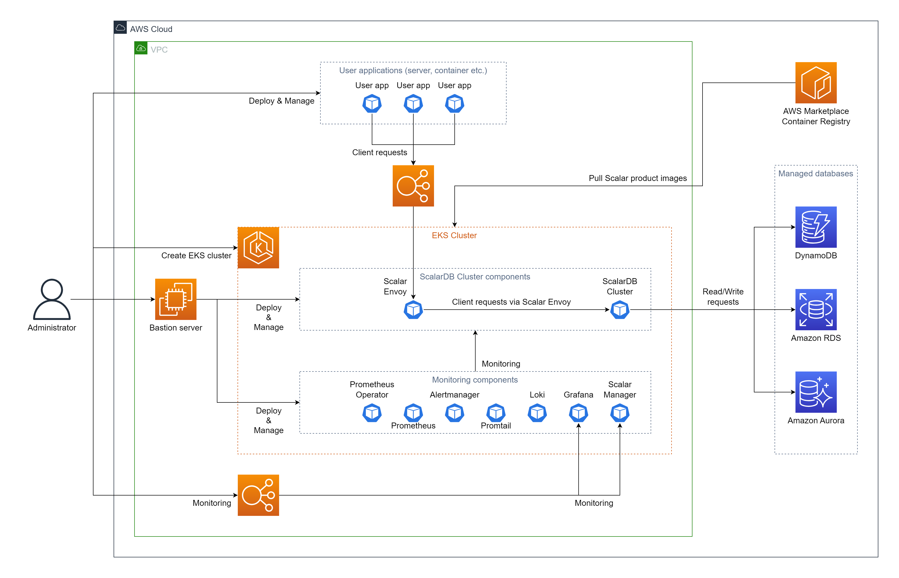

# Deploy ScalarDB Cluster on Amazon Elastic Kubernetes Service (EKS)

This guide explains how to deploy ScalarDB Cluster on Amazon Elastic Kubernetes Service (EKS).

In this guide, you will create one of the following two environments in your AWS environment. The environments differ depending on which [client mode](https://github.com/scalar-labs/scalardb-cluster/blob/main/docs/developer-guide-for-scalardb-cluster-with-java-api.md#client-modes) you use:

* **[`direct-kubernetes` client mode](https://github.com/scalar-labs/scalardb-cluster/blob/main/docs/developer-guide-for-scalardb-cluster-with-java-api.md#direct-kubernetes-client-mode).** In this mode, you deploy your application in the same EKS cluster as your ScalarDB Cluster deployment.

    

* **[`indirect` client mode](https://github.com/scalar-labs/scalardb-cluster/blob/main/docs/developer-guide-for-scalardb-cluster-with-java-api.md#indirect-client-mode).** In this mode, you deploy your application in an environment that is different from the EKS cluster that contains your ScalarDB Cluster deployment.

  

## Step 1. Subscribe to ScalarDB Cluster in AWS Marketplace

You must get the ScalarDB Cluster container image by visiting AWS Marketplace and subscribing to [ScalarDB Cluster Standard Edition (Pay-As-You-Go)](https://aws.amazon.com/marketplace/pp/prodview-jx6qxatkxuwm4) or [ScalarDB Cluster Premium Edition (Pay-As-You-Go)](https://aws.amazon.com/marketplace/pp/prodview-djqw3zk6dwyk6). For details on how to subscribe to ScalarDB Cluster in AWS Marketplace, see [Subscribe to Scalar products from AWS Marketplace](./AwsMarketplaceGuide.md#subscribe-to-scalar-products-from-aws-marketplace).

## Step 2. Create an EKS cluster

You must create an EKS cluster for the ScalarDB Cluster deployment. For details, see [Guidelines for creating an Amazon EKS cluster for Scalar products](./CreateEKSClusterForScalarProducts.md).

## Step 3. Set up a database for ScalarDB Cluster

You must prepare a database before deploying ScalarDB Cluster. To see which types of databases ScalarDB supports, refer to [ScalarDB Supported Databases](https://github.com/scalar-labs/scalardb/blob/master/docs/scalardb-supported-databases.md).

For details on setting up a database, see [Set up a database for ScalarDB/ScalarDL deployment on AWS](./SetupDatabaseForAWS.md).

## Step 4. Create a bastion server

To execute some tools for deploying and managing ScalarDB Cluster on EKS, you must prepare a bastion server in the same Amazon Virtual Private Cloud (VPC) of the EKS cluster that you created in **Step 2**. For details, see [Create a Bastion Server](./CreateBastionServer.md).

## Step 5. Prepare a custom values file for the Scalar Helm Chart

To perform tasks, like accessing information in the database that you created in **Step 3**, you must configure a custom values file for the Scalar Helm Chart for ScalarDB Cluster based on your environment. For details, see [Configure a custom values file for Scalar Helm Charts](https://github.com/scalar-labs/helm-charts/blob/main/docs/configure-custom-values-file.md).

**Note:** If you deploy your application in an environment that is different from the EKS cluster that has your ScalarDB Cluster deployment (i.e., you use `indirect` client mode), you must set the `envoy.enabled` parameter to `true` and the `envoy.service.type` parameter to `LoadBalancer` to access Scalar Envoy from your application.

## Step 6. Deploy ScalarDB Cluster by using the Scalar Helm Chart

Deploy ScalarDB Cluster on your EKS cluster by using the Helm Chart for ScalarDB Cluster. For details, see [Deploy Scalar products using Scalar Helm Charts](https://github.com/scalar-labs/helm-charts/blob/main/docs/how-to-deploy-scalar-products.md).

**Note:** We recommend creating a dedicated namespace by using the `kubectl create ns scalardb-cluster` command and deploying ScalarDB Cluster in the namespace by using the `-n scalardb-cluster` option with the `helm install` command.

## Step 7. Check the status of your ScalarDB Cluster deployment

After deploying ScalarDB Cluster in your EKS cluster, you must check the status of each component. For details, see [Components to Regularly Check When Running in a Kubernetes Environment](./RegularCheck.md).

## Step 8. Monitor your ScalarDB Cluster deployment

After deploying ScalarDB Cluster in your EKS cluster, we recommend monitoring the deployed components and collecting their logs, especially in production. For details, see [Monitoring Scalar products on a Kubernetes cluster](./K8sMonitorGuide.md) and [Collecting logs from Scalar products on a Kubernetes cluster](./K8sLogCollectionGuide.md).

## Step 9. Deploy your application

If you use [`direct-kubernetes` client mode](https://github.com/scalar-labs/scalardb-cluster/blob/main/docs/developer-guide-for-scalardb-cluster-with-java-api.md#direct-kubernetes-client-mode), you must deploy additional Kubernetes resources. For details, see [Deploy your client application on Kubernetes with `direct-kubernetes` mode](https://github.com/scalar-labs/helm-charts/blob/main/docs/how-to-deploy-scalardb-cluster.md#deploy-your-client-application-on-kubernetes-with-direct-kubernetes-mode).

## Remove ScalarDB Cluster from EKS

If you want to remove the environment that you created, please remove all the resources in reverse order from which you created them in.
