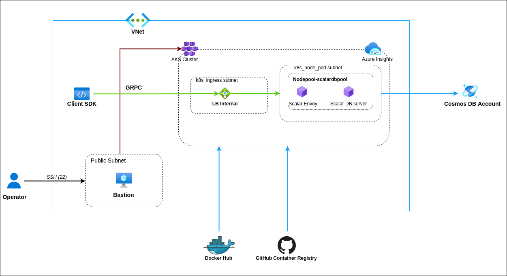

# Deploy Scalar DB server on Azure

Scalar DB server is a gRPC server that implements the Scalar DB interface.
We can deploy the Scalar DB server on any Kubernetes service.
This guide will help you to deploy a Scalar DB server in azure AKS.

## What we create



In this guide, we will create the following components.

* An Azure Virtual Network associated with a Resource Group.
* An AKS cluster with 2 node pools.
* A managed database service.
    * A Cosmos DB Account.
* A Bastion instance with a public IP.
* Azure container insights.


## Prerequisites

You must have required permissions as specified in [Cloud permissions document](./CloudPermissionsForScalarDBOnAKS.md) to create cloud resources to deploy the Scalar DB server on Azure.

## Step 1. Configure your network

Configure a secure network according to your organizational standard or as per the application requirements. This section shows how to configure a secure network for Scalar DB server deployment.

### Requirements

* You must create a virtual network with a subnet for bastion.
* You must create 2 subnets for AKS.

### Recommendations

* You should create a bastion server to manage the Kubernetes cluster for production or you can use VPN to access from the local machine.
* You should create subnets for AKS with a prefix of at least `/22`.

### Steps

* Create a Resource group based on [Azure official guide](https://docs.microsoft.com/en-us/azure/azure-resource-manager/management/manage-resource-groups-portal#create-resource-groups).
* Create an Azure virtual network based on [Azure official guide](https://docs.microsoft.com/en-us/azure/virtual-network/quick-create-portal) with the above requirements and recommendations.
* Create subnets based on [Azure official guide](https://docs.microsoft.com/en-us/azure/virtual-network/virtual-network-manage-subnet) with the above requirements and recommendations.
* Create a virtual machine to use as a bastion server based on [Azure official guide](https://docs.microsoft.com/en-us/azure/virtual-machines/linux/quick-create-portal).

## Step 2. Set up a database

In this step, we will set up a database.

### Requirements

* You must have a database that Scalar DB supports.

### Steps

* Follow [Set up a database guide](https://github.com/scalar-labs/scalar-kubernetes/blob/master/docs/SetupDatabase.md) to set up a database for Scalar DB.

## Step 3. Configure AKS

This section shows how to configure a Kubernetes service for Scalar DB server deployment.

### Prerequisites

Install the following tools on the bastion for controlling the AKS cluster:
* Install [Azure CLI](https://docs.microsoft.com/en-us/cli/azure/install-azure-cli-linux?pivots=dnf): In this guide, Azure CLI is used to create a kubeconfig file to access the AKS cluster.
* Install [Kubectl](https://kubernetes.io/docs/tasks/tools/):  Kubernetes command-line tool to manage AKS cluster. Kubectl 1.19 or higher is required.

### Requirements

* You must have an AKS cluster with Kubernetes version **1.19** or higher for Scalar DB deployment.
* You must create a new `user node pool` for Scalar DB deployment.
* You must create a Kubernetes cluster with `service principal` as the Authentication method.
* You must create a Kubernetes cluster with `Azure CNI`.

### Recommendations

* You should create 3 nodes in each node group for high availability in production.
* You should configure `Autoscale` for the node pools If you want to scale the nodes.

### Steps

* Create an AKS cluster based on [Azure official guide](https://docs.microsoft.com/en-us/azure/aks/kubernetes-walkthrough-portal#create-an-aks-cluster) with the above requirements and recommendations.
* Configure kubectl to connect to your Kubernetes cluster using the `az aks get-credentials` command.

    ```console
    az aks get-credentials --resource-group myResourceGroup --name myAKSCluster
    ```

## Step 4. Install Scalar DB server

In this section, we will deploy the Scalar DB server on the AKS cluster using Helm charts.

### Prerequisites

You must install Helm on your bastion to deploy helm-charts:

* [Helm](https://helm.sh/docs/intro/install/): Helm command-line tool to manage releases in the AKS cluster, Helm version 3.2.1 or latest is required.
  In this guide, it is used to deploy Scalar DB server helm charts to the AKS cluster.

### Steps

1. Download the following Scalar DB configuration files from the [scalar-kubernetes repository](https://github.com/scalar-labs/scalar-kubernetes/tree/master/conf). Note that they are going to be versioned in the future, so you might want to change the branch to use a proper version.
    * scalardb-custom-values.yaml
    
2. Update the database configuration in  scalardb-custom-values.yaml  sections as specified in [configure Scalar DB guide](./ConfigureScalarDB.md).

3. Run the Helm commands on the bastion to install the Scalar DB server on AKS.

   ```console
    # Add Helm charts
      helm repo add scalar-labs https://scalar-labs.github.io/helm-charts
    
    # List the Scalar charts.
      helm search repo scalar-labs
    
    # Install Scalar DB with a release name `my-release-scalardb`
      helm upgrade --version <chart version> --install my-release-scalardb scalar-labs/scalardb --namespace default -f scalardb-custom-values.yaml
   ```

## Step 5. Monitor the cluster

It is critical to actively monitor the overall health and performance of a cluster running in production.
This section shows how to configure container insights for the AKS cluster, Container insights give you performance visibility by collecting memory and processor metrics from controllers, nodes, and containers.
Container insights collect container logs also for log monitoring.
For more information on the container insights, you can follow the [official guide](https://docs.microsoft.com/en-us/azure/azure-monitor/containers/container-insights-overview).

## Recommendations

* You should configure alerting for the AKS cluster based on [Azure official guide](https://docs.microsoft.com/en-us/azure/azure-monitor/containers/container-insights-metric-alerts#enable-alert-rules)

### Steps

* Enable monitoring of Azure Kubernetes Service based on [the official guide](https://docs.microsoft.com/en-us/azure/azure-monitor/containers/container-insights-enable-existing-clusters).

## Step 6. Checklist for confirming Scalar DB server deployment

You can check if the pods and the services are deployed accurately by running the `kubectl get pods,services -o wide` command on the bastion.
* You should confirm the status of all scalardb and envoy pods are `Running`.

```console
kubectl get pods,services -o wide
NAME                                             READY   STATUS    RESTARTS   AGE   IP            NODE                                   NOMINATED NODE   READINESS GATES
pod/my-release-scalardb-5bc8c65447-jwlc4         1/1     Running   0          11s   10.43.40.18   aks-scalardbpool-67464374-vmss000001   <none>           <none>
pod/my-release-scalardb-5bc8c65447-w978k         1/1     Running   0          11s   10.43.40.30   aks-scalardbpool-67464374-vmss000002   <none>           <none>
pod/my-release-scalardb-5bc8c65447-wfbcq         1/1     Running   0          11s   10.43.40.5    aks-scalardbpool-67464374-vmss000000   <none>           <none>
pod/my-release-scalardb-envoy-5b8f69c85c-kj78c   1/1     Running   0          11s   10.43.40.10   aks-scalardbpool-67464374-vmss000000   <none>           <none>
pod/my-release-scalardb-envoy-5b8f69c85c-qstr6   1/1     Running   0          11s   10.43.40.29   aks-scalardbpool-67464374-vmss000002   <none>           <none>
pod/my-release-scalardb-envoy-5b8f69c85c-xfrs9   1/1     Running   0          11s   10.43.40.19   aks-scalardbpool-67464374-vmss000001   <none>           <none>

NAME                                        TYPE        CLUSTER-IP     EXTERNAL-IP   PORT(S)               AGE   SELECTOR
service/kubernetes                          ClusterIP   10.0.0.1       <none>        443/TCP               36m   <none>
service/my-release-scalardb-envoy           ClusterIP   10.0.243.104   <none>        60051/TCP,50052/TCP   11s   app.kubernetes.io/app=envoy,app.kubernetes.io/instance=my-release-scalardb,app.kubernetes.io/name=scalardb
service/my-release-scalardb-envoy-metrics   ClusterIP   10.0.1.246     <none>        9001/TCP              11s   app.kubernetes.io/app=envoy,app.kubernetes.io/instance=my-release-scalardb,app.kubernetes.io/name=scalardb
service/my-release-scalardb-headless        ClusterIP   None           <none>        50051/TCP             11s   app.kubernetes.io/app=scalardb,app.kubernetes.io/instance=my-release-scalardb,app.kubernetes.io/name=scalardb
service/my-release-scalardb-metrics         ClusterIP   10.0.63.5      <none>        8080/TCP              11s   app.kubernetes.io/app=scalardb,app.kubernetes.io/instance=my-release-scalardb,app.kubernetes.io/name=scalardb
```
### Confirm AKS cluster monitoring

* Confirm the Cluster insights based on [Container insights](https://docs.microsoft.com/en-us/azure/azure-monitor/containers/container-insights-overview#how-do-i-access-this-feature) document.

### Confirm database monitoring

* Confirm the monitoring of Azure Cosmos DB based on [Monitor Azure Cosmos DB](https://docs.microsoft.com/en-us/azure/cosmos-db/monitor-cosmos-db) document.

## Clean up the resources

### Uninstall Scalar DB server Install Scalar DB server
```
# Uninstall scalar DB server with a release name 'my-release-scalardb'
helm uninstall my-release-scalardb
```
### Clean up the other resources

You can remove the other resources via the web console or the command-line interface.

For more detail about the command-line interface, please take a look at [the official document]( https://docs.microsoft.com/en-us/cli/azure/).