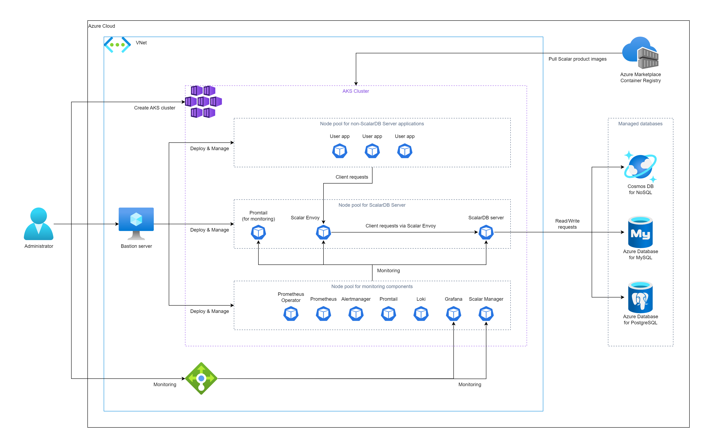
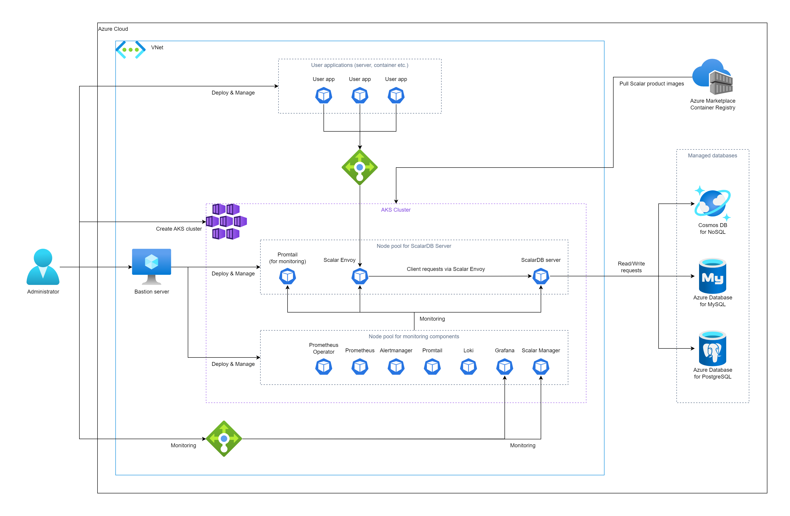

# Deploy ScalarDB Server on Azure Kubernetes Service (AKS)

This guide explains how to deploy ScalarDB Server on Azure Kubernetes Service (AKS).

In this guide, you will create one of the following two environments in your Azure environment. The difference between the two environments is how you plan to deploy the application:

* Deploy your application in the same AKS cluster as your ScalarDB Server deployment. In this case, you don't need to use the load balancers that Azure provides to access Scalar Envoy from your application.
  
    

* Deploy your application in an environment that is different from the AKS cluster that contains your ScalarDB Server deployment. In this case, you must use the load balancers that Azure provides to access Scalar Envoy from your application.

    

## Step 1. Subscribe to ScalarDB Server in Azure Marketplace

You must get the ScalarDB Server container image by visiting [Azure Marketplace](https://azuremarketplace.microsoft.com/en/marketplace/apps/scalarinc.scalardb) and subscribing to ScalarDB Server. For details on how to subscribe to ScalarDB Server in Azure Marketplace, see [Get Scalar products from Microsoft Azure Marketplace](./AzureMarketplaceGuide.md#get-scalar-products-from-microsoft-azure-marketplace).

## Step 2. Create an AKS cluster

You must create an AKS cluster for the ScalarDB Server deployment. For details, see [Guidelines for creating an AKS cluster for Scalar products](./CreateAKSClusterForScalarProducts.md).

## Step 3. Set up a database for ScalarDB Server

You must prepare a database before deploying ScalarDB Server. To see which types of databases ScalarDB supports, refer to [ScalarDB Supported Databases](https://github.com/scalar-labs/scalardb/blob/master/docs/scalardb-supported-databases.md).

For details on setting up a database, see [Set up a database for ScalarDB/ScalarDL deployment in Azure](./SetupDatabaseForAzure.md).

## Step 4. Create a bastion server

To execute some tools for deploying and managing ScalarDB Server on AKS, you must prepare a bastion server in the same Azure Virtual Network (VNet) of the AKS cluster that you created in **Step 2**.  For details, see [Create a Bastion Server](./CreateBastionServer.md).

## Step 5. Prepare a custom values file for the Scalar Helm Chart

To perform tasks, like accessing information in the database that you created in **Step 3**, you must configure a custom values file for the Scalar Helm Chart for ScalarDB Server based on your environment. For details, see [Configure a custom values file of Scalar Helm Chart](https://github.com/scalar-labs/helm-charts/blob/main/docs/configure-custom-values-file.md). 

**Note:** If you deploy your application in an environment that is different from the AKS cluster that has your ScalarDB Server deployment, you must set the `envoy.service.type` parameter to `LoadBalancer` to access Scalar Envoy from your application.

## Step 6. Deploy ScalarDB Server by using the Scalar Helm Chart

Deploy ScalarDB Server on your AKS cluster by using the Helm Chart for ScalarDB Server. For details, see [Deploy Scalar Products using Scalar Helm Chart](https://github.com/scalar-labs/helm-charts/blob/main/docs/how-to-deploy-scalar-products.md).

**Note:** We recommend creating a dedicated namespace by using the `kubectl create ns scalardb` command and deploying ScalarDB Server in the namespace by using the `-n scalardb` option with the `helm install` command.

## Step 7. Check the status of your ScalarDB Server deployment

After deploying ScalarDB Server in your AKS cluster, you must check the status of each component. For details, see [Components to Regularly Check When Running in a Kubernetes Environment](./RegularCheck.md).

## Step 8. Monitor your ScalarDB Server deployment

After deploying ScalarDB Server in your AKS cluster, we recommend monitoring the deployed components and collecting their logs, especially in production. For details, see [Monitoring Scalar products on a Kubernetes cluster](./K8sMonitorGuide.md) and [Collecting logs from Scalar products on a Kubernetes cluster](./K8sLogCollectionGuide.md).

## Remove ScalarDB Server from AKS

If you want to remove the environment that you created, please remove all the resources in reverse order from which you created them in.
