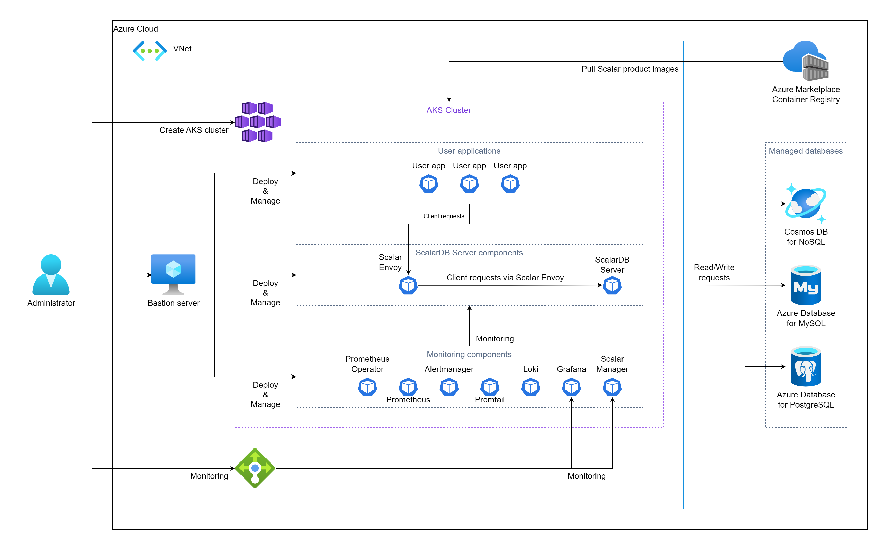

# Deploy ScalarDB Server on Azure Kubernetes Service (AKS)

ScalarDB Server is a gRPC server that implements the ScalarDB interface. With ScalarDB Server, you can use ScalarDB features from multiple programming languages that are supported by gRPC. We can deploy ScalarDB Server on any Kubernetes services. This document explains how to deploy ScalarDB Server on AKS.

## What we create

In this guide, we create one of the following two environments on your Azure account. The difference is application deployment.

* Deploy your application on the same AKS cluster as ScalarDB Server deployment. In this case, you don't need to use the load balancers that Azure provides to access Scalar Envoy from your application.
  

* Deploy your application on other environments than the AKS cluster that you deploy ScalarDB Server. In this case, you must use the load balancers that Azure provides to access Scalar Envoy from your application.
  

## Step 1. Subscribe to ScalarDB Server in Azure Marketplace

You can get the ScalarDB Server container image from [Azure Marketplace](https://azuremarketplace.microsoft.com/en/marketplace/apps/scalarinc.scalardb). First, you need to subscribe to it. For more details on how to subscribe to ScalarDB Server in Azure Marketplace, see [Get Scalar products from Microsoft Azure Marketplace - How to install Scalar products through Azure Marketplace](./AzureMarketplaceGuide.md#get-scalar-products-from-microsoft-azure-marketplace).

## Step 2. Create an AKS cluster

Create an AKS cluster for the deployment of ScalarDB Server. See [Create an AKS cluster for Scalar products](./CreateAKSClusterForScalarProducts.md) for more details.

## Step 3. Set up a database for ScalarDB Server

ScalarDB supports [several databases](https://github.com/scalar-labs/scalardb/blob/master/docs/scalardb-supported-databases.md). You need to prepare a database before you deploy ScalarDB Server. See [Set up a database for ScalarDB/ScalarDL deployment in Azure](./SetupDatabaseForAzure.md) for more details.

## Step 4. Create a bastion server

For executing some tools to deploy and manage ScalarDB Server on AKS, you need to prepare a bastion server in the same VNet of the AKS cluster you created in **Step 2**. See [Create a bastion server](./CreateBastionServer.md) for more details.

## Step 5. Prepare a custom values file of Helm

You need to configure a custom values file for the Helm Chart of ScalarDB Server based on your environment (e.g., access information of the database you created in **Step 3**). See [Configure a custom values file of Scalar Helm Chart](https://github.com/scalar-labs/helm-charts/blob/main/docs/configure-custom-values-file.md) for more details. 

Note: When you deploy your application on other environments than the AKS cluster that you deploy ScalarDB Server, you have to set the `LoadBalancer` to the `envoy.service.type` parameter to access Scalar Envoy from your application.

## Step 6. Deploy ScalarDB Server using Scalar Helm Chart

Deploy ScalarDB Server on your AKS cluster using Scalar Helm Chart. See [Deploy Scalar Products using Scalar Helm Chart](https://github.com/scalar-labs/helm-charts/blob/main/docs/how-to-deploy-scalar-products.md) for more details.

Note: We recommend creating a dedicated namespace by using the `kubectl create ns scalardb` command and deploying ScalarDB Server in the namespace by using the `-n scalardb` option with the `helm install` command.

## Step 7. Check the status of ScalarDB Server deployment

After deploying ScalarDB Server on your AKS cluster, you need to check the status of each component. See [What you might want to check on a regular basis](./RegularCheck.md) for more details.

## Step 8. Monitoring for ScalarDB Server deployment

After deploying ScalarDB Server on your AKS cluster, we recommend monitoring the deployed components and collecting their logs, especially in production. See [Monitoring Scalar products on a Kubernetes cluster](./K8sMonitorGuide.md) and [Collecting logs from Scalar products on a Kubernetes cluster](./K8sLogCollectionGuide.md) for more details.

---

## Uninstall ScalarDB Server on AKS

If you want to uninstall the environment you created, please uninstall/remove resources in the reverse order of creation.
