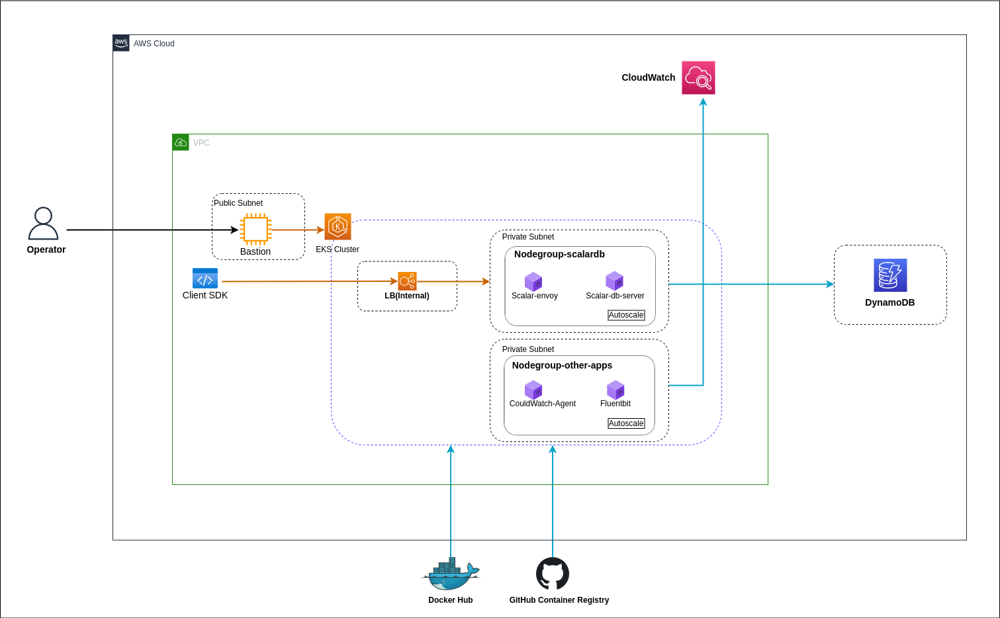

# Deploy Scalar DB Server on AWS

The Scalar DB server is a standalone gRPC server that implements the Scalar DB interface.
We can deploy the Scalar DB server on any Kubernetes service.
This guide will help you to deploy a Scalar DB server in AWS EKS.

## What we create



In this guide, we will create the following components.

* A VPC with NAT gateway
* An EKS cluster with two Kubernetes node groups
* A managed database service supported by Scalar DB.
* A Bastion instance with a public IP
* Amazon CloudWatch


## Step 1. Configure your network

Configure a secure network according to your organizational standard or application requirements. This section shows how to configure a secure network for Scalar DB server deployment.

### Requirements

* You must create VPC with public NAT gateways on private networks. NAT gateway is necessary to enable internet access (to pull Scalar DB server image for Kubernetes deployment ) for Kubernetes node group subnets.
* You must follow this [AWS official guide](https://docs.aws.amazon.com/eks/latest/userguide/network_reqs.html) when creating subnets for EKS.

### Recommendations

* You should create private subnets for the Kubernetes cluster for production.
* You should create a bastion server to manage the Kubernetes cluster.
* You should create 3 subnets in 3 availability zones for the Kubernetes cluster for higher availability.
* You should create subnets with the prefix at least `/24` for the Kubernetes cluster to work without issues even after scaling.

### Steps

* Create an Amazon VPC based on the [AWS official guide](https://docs.aws.amazon.com/eks/latest/userguide/creating-a-vpc.html) with the above requirements and recommendations.

## Step 2. Set up a database

In this section, you will set up a database for the Scalar DB server.

### Requirements

* You must have a database that the Scalar DB server supports.

### Steps

* Follow [Set up a database guide](./SetupDatabase.md) to set up a database for Scalar DB.

## Step 3. Configure EKS

This section shows how to create an EKS cluster and 2 managed node groups (one for Scalar DB server and envoy, and the other for logs and metrics collection) for the Scalar DB server and monitor agent deployment.

### Prerequisites

Install the following tools on your bastion for controlling the EKS cluster:
* [AWS CLI](https://docs.aws.amazon.com/cli/latest/userguide/getting-started-install.html): In this guide, AWS CLI is used to create a kubeconfig file to access the EKS cluster.
* [kubectl](https://docs.aws.amazon.com/eks/latest/userguide/install-kubectl.html): Kubernetes command-line tool to manage EKS cluster. Kubectl 1.19 or higher is required.
* [eksctl](https://docs.aws.amazon.com/eks/latest/userguide/eksctl.html): eksctl is a simple command line utility for creating and managing Kubernetes clusters on Amazon EKS.

### Requirements

* You must create a Kubernetes cluster with version 1.19 or higher for Scalar DB server deployment.
* You must create a node group with the label, key as `agentpool` and value as `scalardbpool` for Scalar DB server deployment.
* You must add set the EKS security group by following the [AWS official guide](https://docs.aws.amazon.com/eks/latest/userguide/sec-group-reqs.html).

### Recommendations

* You should create 3 nodes in each node group for high availability in the production.
* You should configure Cluster autoscaler based on the [AWS official guide](https://docs.aws.amazon.com/eks/latest/userguide/cluster-autoscaler.html) to scale the number of nodes in your cluster.

### Steps

* Create an Amazon EKS cluster based on the [AWS official guide](https://docs.aws.amazon.com/eks/latest/userguide/create-cluster.html).
* Create a managed node group based on the [AWS official guide](https://docs.aws.amazon.com/eks/latest/userguide/create-managed-node-group.html) with the above requirements and recommendations.
* Configure kubectl to connect to your Kubernetes cluster by following the [AWS official guide](https://docs.aws.amazon.com/eks/latest/userguide/create-kubeconfig.html).

## Step 4. Install Scalar DB server

After creating a Kubernetes cluster, the next step is to deploy the Scalar DB server into the EKS cluster.
This section shows how to install the Scalar DB server to the EKS cluster with [Helm charts](https://github.com/scalar-labs/helm-charts).

### Prerequisites

Install the Helm on your bastion server to deploy helm charts:

* [Helm](https://helm.sh/docs/intro/install/): Helm is a command-line tool to manage releases in the EKS cluster. In this tutorial, it is used to deploy the Scalar DB server helm chart to the EKS cluster. Helm version 3.5 or the latest is required.

### Steps

The following steps show how to install the Scalar DB server on EKS:

1. Download the following Scalar DB server configuration files from the [scalar-kubernetes repository](../conf).
   Note that they may be versioned in the future, so you might want to change the branch to use a proper version.
    * scalardb-custom-values.yaml

2. Update the database configuration in scalardb-custom-values.yaml sections as specified in [configure Scalar DB guide](./ConfigureScalarDB.md).
3. Run the Helm commands on the bastion server to install the Scalar DB server on EKS

   ```console
    # Add Helm charts
      helm repo add scalar-labs https://scalar-labs.github.io/helm-charts
    
    # List the Scalar charts.
      helm search repo scalar-labs
    
    # Install Scalar DB with a release name `my-release-scalardb`
      helm upgrade --version <chart version> --install my-release-scalardb scalar-labs/scalardb --namespace default -f scalardb-custom-values.yaml
    ```

Note:

* The same commands can be used to upgrade the pods.
* Release name `my-release-scalardb` can be changed at your convenience.
* The `chart version` can be obtained from `helm search repo scalar-labs` output
* `helm ls -a` command can list currently installed releases.

## Step 5. Monitor the Cluster

It is critical to actively monitor the overall health and performance of the cluster running in production.
You can use Container Insights to collect performance metrics and Fluent Bit to collect logs of the EKS cluster.
This section shows how to configure monitoring and logging for your EKS cluster.

### Requirements

* You must create a CloudWatch Logs policy with the required policy by following this [AWS official guide](https://docs.aws.amazon.com/AmazonCloudWatch/latest/monitoring/Container-Insights-prerequisites.html). 

### Recommendations

* You should enable monitoring for EKS in production.
* You should configure the cloudwatch agent in the EKS cluster for collecting metrics from pods.
* You should configure Fluent Bit in the EKS cluster for collecting logs from pods.

### Steps

* Setup CloudWatch agent and Fluent Bit in the EKS cluster based on [AWS official guide](https://docs.aws.amazon.com/AmazonCloudWatch/latest/monitoring/Container-Insights-setup-EKS-quickstart.html).

## Step 6. Checklist for confirming Scalar DB server deployment

You can check if the pods and the services are deployed correctly by running the `kubectl get pods,services -o wide` command on the bastion.
* You should confirm the status of all scalardb and envoy pods are `Running`.

```console
kubectl get pods,services -o wide
NAME                                             READY   STATUS    RESTARTS   AGE    IP             NODE                                          NOMINATED NODE   READINESS GATES
pod/my-release-scalardb-556c8564b4-bbkw8         1/1     Running   0          7m2s   10.42.41.83    ip-10-42-41-39.ap-south-1.compute.internal    <none>           <none>
pod/my-release-scalardb-556c8564b4-hb75t         1/1     Running   0          7m2s   10.42.41.254   ip-10-42-41-205.ap-south-1.compute.internal   <none>           <none>
pod/my-release-scalardb-556c8564b4-z2l9r         1/1     Running   0          7m2s   10.42.42.7     ip-10-42-42-151.ap-south-1.compute.internal   <none>           <none>
pod/my-release-scalardb-envoy-5c4c6d6cf4-ntlrg   1/1     Running   0          7m2s   10.42.41.5     ip-10-42-41-39.ap-south-1.compute.internal    <none>           <none>
pod/my-release-scalardb-envoy-5c4c6d6cf4-qt8rd   1/1     Running   0          7m2s   10.42.41.119   ip-10-42-41-205.ap-south-1.compute.internal   <none>           <none>
pod/my-release-scalardb-envoy-5c4c6d6cf4-ttsmm   1/1     Running   0          7m2s   10.42.42.11    ip-10-42-42-151.ap-south-1.compute.internal   <none>           <none>

NAME                                        TYPE           CLUSTER-IP     EXTERNAL-IP                                                                      PORT(S)                           AGE     SELECTOR
service/kubernetes                          ClusterIP      172.20.0.1     <none>                                                                           443/TCP                           3h15m   <none>
service/my-release-scalardb-envoy           LoadBalancer   172.20.85.38   adddfd88152a94cb6a912e3422a837b2-f0f412ff1c333b27.elb.ap-south-1.amazonaws.com   60051:31239/TCP,50052:31839/TCP   7m2s    app.kubernetes.io/app=envoy,app.kubernetes.io/instance=my-release-scalardb,app.kubernetes.io/name=scalardb
service/my-release-scalardb-envoy-metrics   ClusterIP      172.20.15.79   <none>                                                                           9001/TCP                          7m2s    app.kubernetes.io/app=envoy,app.kubernetes.io/instance=my-release-scalardb,app.kubernetes.io/name=scalardb
service/my-release-scalardb-headless        ClusterIP      None           <none>                                                                           50051/TCP                         7m2s    app.kubernetes.io/app=scalardb,app.kubernetes.io/instance=my-release-scalardb,app.kubernetes.io/name=scalardb
service/my-release-scalardb-metrics         ClusterIP      172.20.11.48   <none>                                                                           8080/TCP                          7m2s    app.kubernetes.io/app=scalardb,app.kubernetes.io/instance=my-release-scalardb,app.kubernetes.io/name=scalardb
```


### Confirm EKS cluster monitoring

* Confirm the EKS cluster metrics are available in CloudWatch `Container Insights`.
* Confirm the Container logs are available in CloudWatch `Log`.

### Confirm Database monitoring

* Ensure the database monitoring of your database is enabled and confirm the database metrics are available.

## Clean up the resources

When you need to remove the resources you created, remove them in the following order.

* Scalar DB server
* Managed node group
* EKS cluster
* Scalar DB supported managed database service
* Bastion server
* NAT gateway
* VPC

### Uninstall Scalar DB server

You can uninstall Scalar DB server installation with the following Helm commands:

   ```console
    # Uninstall Scalar DB server with a release name 'my-release-scalardb'
    helm uninstall my-release-scalardb
   ```

### Clean up the other resources

You can remove the other resources via the web console or the command-line interface.

For more detail about the command-line interface, please check the [official document](https://docs.aws.amazon.com/cli/index.html?nc2=h_ql_doc_cli).
