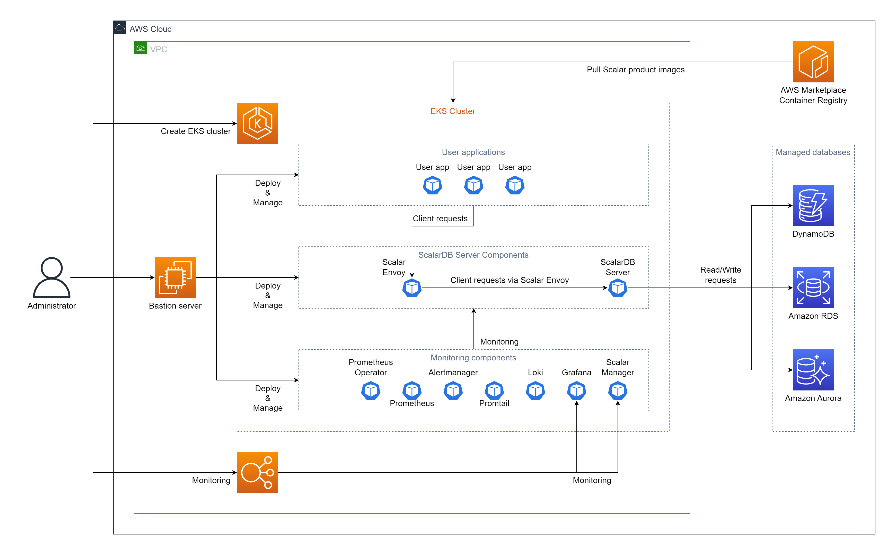
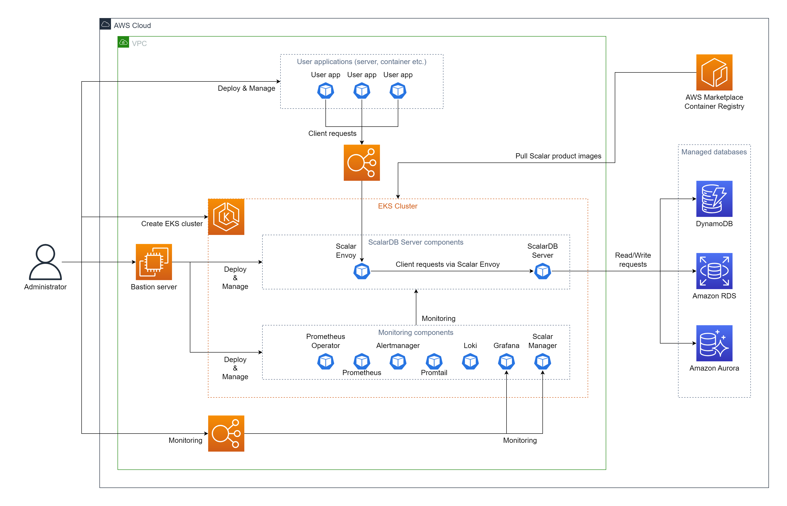

# Deploy ScalarDB Server on Amazon EKS (Amazon Elastic Kubernetes Service)

This guide explains how to deploy ScalarDB Server on Amazon Elastic Kubernetes Service (EKS).

In this guide, you will create one of the following two environments in your AWS environment. The difference between the two environments is how you plan to deploy the application:

* Deploy your application on the same EKS cluster as ScalarDB Server deployment. In this case, you don't need to use the load balancers that AWS provides to access Scalar Envoy from your application.
  

* Deploy your application on other environments than the EKS cluster that you deploy ScalarDB Server. In this case, you must use the load balancers that AWS provides to access Scalar Envoy from your application.
  

## Step 1. Subscribe to ScalarDB Server in AWS Marketplace

You can get the ScalarDB Server container image from [AWS Marketplace](https://aws.amazon.com/marketplace/pp/prodview-rzbuhxgvqf4d2). First, you need to subscribe to it. For more details on how to subscribe to ScalarDB Server in AWS Marketplace, see [Subscribe to Scalar products from AWS Marketplace - How to install Scalar products through AWS Marketplace](./AwsMarketplaceGuide.md#subscribe-to-scalar-products-from-aws-marketplace).

## Step 2. Create an EKS cluster

Create an EKS cluster for the deployment of ScalarDB Server. See [Create an Amazon EKS cluster for Scalar products](./CreateEKSClusterForScalarProducts.md) for more details.

## Step 3. Set up a database for ScalarDB Server

ScalarDB supports [several databases](https://github.com/scalar-labs/scalardb/blob/master/docs/scalardb-supported-databases.md). You need to prepare a database before you deploy ScalarDB Server. See [Set up a database for ScalarDB/ScalarDL deployment on AWS](./SetupDatabaseForAWS.md) for more details.

## Step 4. Create a bastion server

For executing some tools to deploy and manage ScalarDB Server on EKS, you need to prepare a bastion server in the same VPC of the EKS cluster you created in **Step 2**. See [Create a bastion server](./CreateBastionServer.md) for more details.

## Step 5. Prepare a custom values file of Helm

You need to configure a custom values file for the Helm Chart of ScalarDB Server based on your environment (e.g., access information of the database you created in **Step 3**). See [Configure a custom values file for Scalar Helm Charts](https://github.com/scalar-labs/helm-charts/blob/main/docs/configure-custom-values-file.md) for more details.

Note: When you deploy your application on other environments than the EKS cluster that you deploy ScalarDB Server, you have to set the `LoadBalancer` to the `envoy.service.type` parameter to access Scalar Envoy from your application.

## Step 6. Deploy ScalarDB Server using Scalar Helm Chart

Deploy ScalarDB Server on your EKS cluster using Scalar Helm Chart. See [Deploy Scalar products using Scalar Helm Charts](https://github.com/scalar-labs/helm-charts/blob/main/docs/how-to-deploy-scalar-products.md) for more details.

Note: We recommend creating a dedicated namespace by using the `kubectl create ns scalardb` command and deploying ScalarDB Server in the namespace by using the `-n scalardb` option with the `helm install` command.

## Step 7. Check the status of ScalarDB Server deployment

After deploying ScalarDB Server on your EKS cluster, you need to check the status of each component. See [What you might want to check on a regular basis](./RegularCheck.md) for more details.

## Step 8. Monitoring for ScalarDB Server deployment

After deploying ScalarDB Server on your EKS cluster, we recommend monitoring the deployed components and collecting their logs, especially in production. See [Monitoring Scalar products on a Kubernetes cluster](./K8sMonitorGuide.md) and [Collecting logs from Scalar products on a Kubernetes cluster](./K8sLogCollectionGuide.md) for more details.

---

## Uninstall ScalarDB Server on EKS

If you want to uninstall the environment you created, please uninstall/remove resources in the reverse order of creation.
