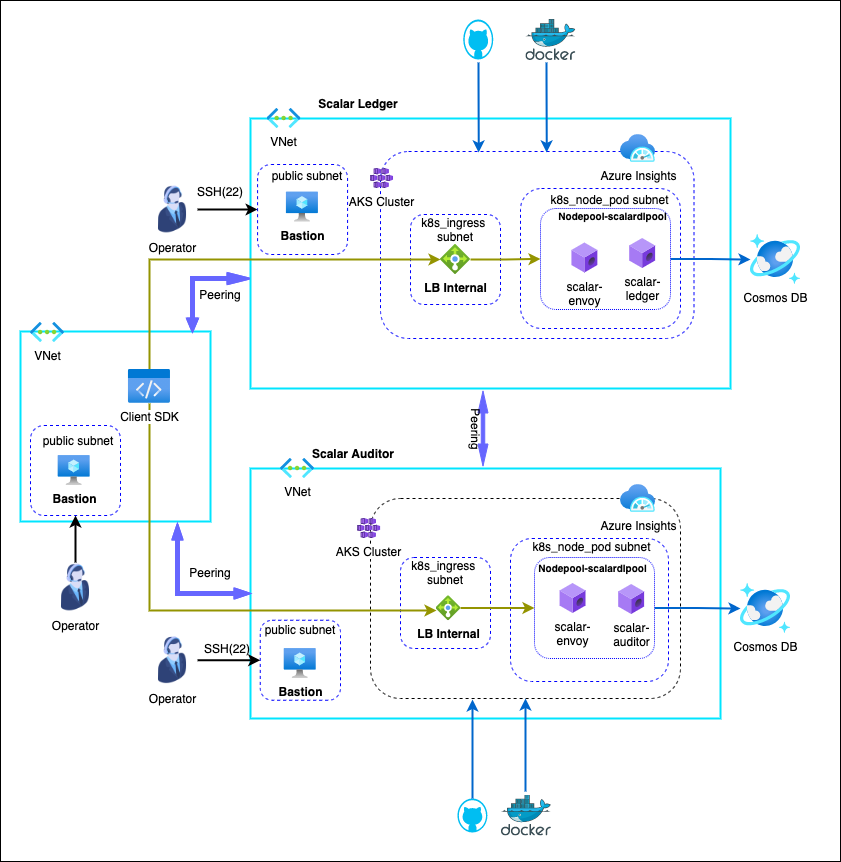

# Deploy ScalarDL Ledger and ScalarDL Auditor on AKS (Azure Kubernetes Service)

ScalarDL is scalable and practical Byzantine fault detection middleware for transactional database systems, which achieves correctness, scalability, and database agnosticism.  

ScalarDL is composed of [Ledger](https://github.com/scalar-labs/scalardl/blob/master/docs/getting-started.md), [Auditor](https://github.com/scalar-labs/scalardl/blob/master/docs/getting-started-auditor.md), and [Client SDK](https://github.com/scalar-labs/scalardl/tree/master/docs#client-sdks). ScalarDL Ledger manages application data in its own unique way using hash-chain and digital signature. ScalarDL Auditor is an optional component and manages a copy of Ledger data without depending on Ledger to identify the discrepancy between Ledger and Auditor data. The Client SDK is a set of user-facing programs to interact with Ledger and Auditor.  

We can deploy **ScalarDL Ledger** and **ScalarDL Auditor** on any Kubernetes services. This document explains how to deploy **ScalarDL Ledger** and **ScalarDL Auditor** on AKS.  

## What we create

In this guide, we create the following environment on your Azure account.  

// TODO: Update the figure based on the latest document

## Step 1. Subscribe to ScalarDL Ledger and ScalarDL Auditor in Azure Marketplace

You can get the container images of ScalarDL Ledger and ScalarDL Auditor from [Azure Marketplace](https://azuremarketplace.microsoft.com/en/marketplace/apps/scalarinc.scalardl).  

First, you need to subscribe to them. Please refer to the following document to subscribe to ScalarDL Ledger and ScalarDL Auditor in Azure Marketplace.  

* [How to install Scalar products through Azure Marketplace](./AzureMarketplaceGuide.md)

Note: Please see the **Get Scalar products from Microsoft Azure Marketplace** section in the above document.  

## Step 2. Set up a database for ScalarDL Ledger

ScalarDL Ledger uses ScalarDB in its internal to access a database and ScalarDB supports [several databases](https://github.com/scalar-labs/scalardb/blob/master/docs/scalardb-supported-databases.md). You need to prepare a database before you deploy ScalarDL Ledger.  

Please refer to the following document for more details.  

* [Set up a database for ScalarDB/ScalarDL deployment in Azure](./SetupDatabaseForAzure.md) // TODO: Update existing document

## Step 3. Set up a database for ScalarDL Auditor

ScalarDL Auditor uses ScalarDB in its internal to access a database and ScalarDB supports [several databases](https://github.com/scalar-labs/scalardb/blob/master/docs/scalardb-supported-databases.md). You need to prepare a database before you deploy ScalarDL Auditor.  

Please refer to the following document for more details.  

* [Set up a database for ScalarDB/ScalarDL deployment in Azure](./SetupDatabaseForAzure.md) // TODO: Update existing document

## Step 4. Create an AKS cluster for ScalarDL Ledger

Create an AKS cluster for the deployment of ScalarDL Ledger. Please refer to the following document for more details.  

* [Create an AKS cluster for Scalar Products]() // TODO: Create a new document

## Step 5. Create an AKS cluster for ScalarDL Auditor

Create an AKS cluster for the deployment of ScalarDL Auditor. Please refer to the following document for more details.  

* [Create an AKS cluster for Scalar Products]() // TODO: Create a new document

## Step 6. Create a bastion server for ScalarDL Ledger

For executing some tools to deploy and manage ScalarDL Ledger on AKS, you need to prepare a bastion server in the same VNet of the AKS cluster you created in **Step 4**. Please refer to the following document for more details.  

* [Create a bastion server]() // TODO: Create a new document

## Step 7. Create a bastion server for ScalarDL Auditor

For executing some tools to deploy and manage ScalarDL Auditor on AKS, you need to prepare a bastion server in the same VNet of the AKS cluster you created in **Step 5**. Please refer to the following document for more details.  

* [Create a bastion server]() // TODO: Create a new document

## Step 8. Create network peering between two AKS clusters

To make ScalarDL work properly, ScalarDL Ledger and ScalarDL Auditor need to connect with each other. So, you need to connect two VNets using [Virtual Network Peering](https://docs.microsoft.com/en-us/azure/virtual-network/virtual-network-peering-overview). Please refer to the following document for more details.  

* [Create network peering for ScalarDL Auditor mode]() // TODO: Create a new document

## Step 9. Prepare a custom values file of Helm Chart of ScalarDL Ledger

You need to configure a custom values file for the Helm Chart of ScalarDL Ledger and ScalarDL Schema Loader (for Ledger) based on your environment (e.g., access information of the database you created in **Step 2**). Please refer to the following document for more details.  

## Step 10. Deploy ScalarDL Ledger using Scalar Helm Chart

Deploy ScalarDL Ledger on your AKS cluster using Scalar Helm Chart. Please refer to the following document for more details.  

* [Deploy Scalar Products using Scalar Helm Chart]() // TODO: Create a new document in the Scalar Helm Chart repository

## Step 11. Prepare a custom values file of Helm Chart of ScalarDL Auditor

You need to configure a custom values file for the Helm Chart of ScalarDL Auditor and ScalarDL Schema Loader (for Auditor) based on your environment (e.g., access information of the database you created in **Step 3**). Please refer to the following document for more details.  

* [Configure a custom values file of Scalar Helm Chart]() // TODO: Create a new document in the Scalar Helm Chart repository

## Step 12. Deploy ScalarDL Auditor using Scalar Helm Chart

Deploy ScalarDL Auditor on your AKS cluster using Scalar Helm Chart. Please refer to the following document for more details.  

* [Deploy Scalar Products using Scalar Helm Chart]() // TODO: Create a new document in the Scalar Helm Chart repository

## Step 13. Check the status of ScalarDL Ledger deployment

After deploying ScalarDL Ledger on your AKS cluster, you need to check the status of each component. Please refer to the following document for more details.  

* [What you might want to check on a regular basis](./RegularCheck.md) // TODO: Update existing document

## Step 14. Check the status of ScalarDL Auditor deployment

After deploying ScalarDL Auditor on your AKS cluster, you need to check the status of each component. Please refer to the following document for more details.  

* [What you might want to check on a regular basis](./RegularCheck.md) // TODO: Update existing document

## Step 15. Monitoring for ScalarDL Ledger deployment

After deploying ScalarDL Ledger on your AKS cluster, it is recommended to monitor the deployed components and collect their logs, especially in production. Please refer to the following document for more details.  

* [Kubernetes Monitor Guide](./K8sMonitorGuide.md) // TODO: Update existing document
* [How to collect logs from Kubernetes applications](./K8sLogCollectionGuide.md) // TODO: Update existing document

## Step 16. Monitoring for ScalarDL Auditor deployment

After deploying ScalarDL Auditor on your AKS cluster, it is recommended to monitor the deployed components and collect their logs, especially in production. Please refer to the following document for more details.  

* [Kubernetes Monitor Guide](./K8sMonitorGuide.md) // TODO: Update existing document
* [How to collect logs from Kubernetes applications](./K8sLogCollectionGuide.md) // TODO: Update existing document

---

## Uninstall ScalarDL Ledger and ScalarDL Auditor on AKS

If you want to uninstall the environment you created, please uninstall/remove resources in the reverse order of creation.  // TODO: Add delete steps in each document
