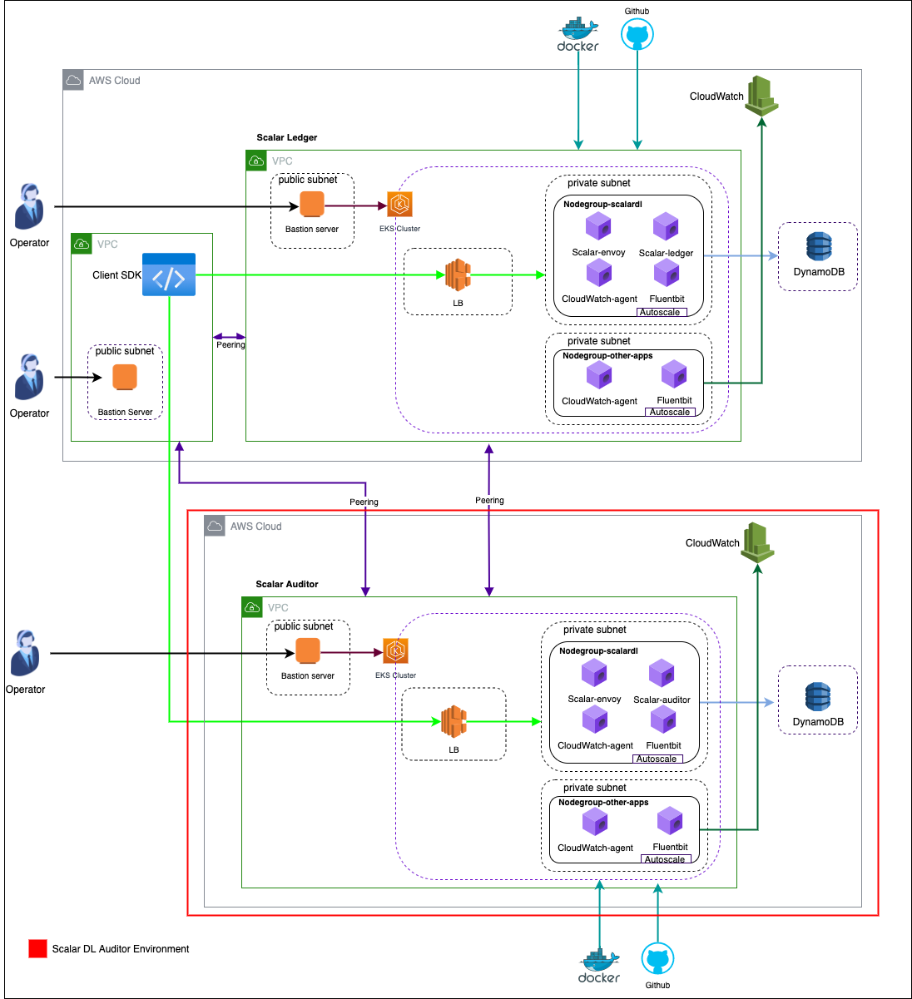

# Deploy Scalar DL Auditor on AWS

Scalar DL Auditor is an optional component that manages the identical states of Ledger and helps Scalar DL clients to detect Byzantine faults.
This guide shows you how to manually deploy Scalar DL Auditor on a managed database service and a managed Kubernetes service in AWS as part of deploying Scalar DL for production.

## What we create



In this guide, we will create the following components for Auditor.

* A VPC with NAT gateway
* An EKS cluster with two Kubernetes node groups
* A managed database service
    * DynamoDB
* A Bastion instance with a public IP
* Amazon CloudWatch

## Prerequisites

* Scalar DL Ledger deployment with Auditor configuration completed.

## Step 1. Create environment

It is highly recommended to deploy Scalar DL Auditor in a different administrative domain from the one for Ledger in production because a single fully-privileged administrator can do any malicious activities in a single administrative domain.
However, for ease of explanation, we deploy Auditor in the same administrative domain as Ledger (i.e., a different cluster on the same subscription) in this guide.

You need to configure a network, Scalar DL supported database, and EKS service in a different administrative domain for Auditor deployment using the steps of creating a Ledger environment.

### Requirements

* You must create a VPC for Auditor with a different IP address range, that is not used by Ledger and Client.
* You must configure your network.
* You must set up a database.
* You must configure EKS.

### Recommendations

* You should deploy Ledger and Auditor in separate administrative domains.

### Steps

* Follow step 1 to step 3 in the [Deploy Scalar DL on AWS](./ManualDeploymentGuideScalarDLOnAWS.md) guide to create a Scalar DL Auditor environment.

## Step 2. Peer the Virtual Networks

In this guide, Ledger, Auditor, and Client applications are deployed on the private subnet of the different VPCs, 
so you need to add peering for internal communication between the Auditor, Ledger, and Client application.  

### Requirements

* You must create peering between Ledger, Auditor, and Client VPCs to enable communication between private networks.
* You must update Ledger, Auditor, and Client route tables for VPC peering connections.

### Recommendations

* You should create Network ACLs for Ledger and Auditor VPCs.
* You should set up the Network ACLs of the Ledger and Auditor to restrict unused accesses.

### Steps

* Create 3 peering connections between the Ledger, Auditor and Client VPCs based on the [AWS official guide](https://docs.aws.amazon.com/vpc/latest/peering/create-vpc-peering-connection.html).
    * Peering between Ledger and Auditor.
    * Peering between Ledger and Client.
    * Peering between Auditor and Client.
* Update route tables for VPC peering connection based on the [AWS official guide](https://docs.aws.amazon.com/vpc/latest/peering/vpc-peering-routing.html).
* Add new Inbound and Outbound rules to restrict unwanted access to Ledger and Auditor.
    * Add new Inbound rules to Ledger Network ACLs to allow ephemeral ports (1024–65535) to access Ledger Envoy LoadBalancer (e.g., 50051 and 50052 by default) from the Auditor and Client.
        * You must set high priority to this rule.
    * Add new Inbound rules to Ledger Network ACLs to restrict access to all ports except ephemeral ports from the Auditor and Client.
        * You must set the next priority to this rule.
    * Add new Inbound rules to Ledger Network ACLs to allow all access from the internet.
        * You must set the next priority to this rule.
    * Add new Outbound rules to the Ledger Network ACLs to allow all access to the internet.
    * Add all Ledger subnets to subnet associations of Ledger Network ACLs.
    * Add new Inbound rules to Auditor Network ACLs to allow ephemeral ports (1024–65535) to access Auditor Envoy LoadBalancer (e.g., 40051 and 40052 by default) from the Ledger and Client.
        * You must set high priority to this rule.
    * Add new Inbound rules to Auditor Network ACLs to restrict access to all ports except ephemeral ports from the Ledger and Client.
        * You must set the next priority to this rule.
    * Add new Inbound rules to Ledger Network ACLs to allow all access from the internet.
        * You must set the next priority to this rule.
    * Add new Outbound rules to the Auditor Network ACLs to allow all access to the internet.
    * Add all Auditor subnets to subnet associations of Auditor Network ACLs.

Note: - We expect you have created the Client VPC for your application deployment.

## Step 3. Install Scalar DL Auditor

### Prerequisites

You must install Helm on your bastion to deploy [helm-charts](https://github.com/scalar-labs/helm-charts):

* [Helm](https://helm.sh/docs/intro/install/): Helm command-line tool to manage releases in the EKS cluster, Helm version 3.2.1 or latest is required. In this guide, it is used to deploy Scalar DL Auditor and Schema loading helm charts to the EKS cluster.
* You must create a Github Personal Access Token (PAT) on the basis of Github official document with `read:packages` scope, it is used to access the `scalar-auditor` and `scalardl-schema-loader` container images from GitHub Packages.

### Requirements

* You must have the authority to pull `scalar-auditor` and `scalardl-schema-loader` container images.

### Recommendations

* You should set the replica count of the Auditor and Envoy pods in the `scalardl-audit-custom-values.yaml` file, which should be equal to the number of nodes in the `scalardlpool`. Otherwise, there is a chance for resource shortage for pod creation.
* You should create an equal number of pods and Envoy pods for Ledger and Auditor for better performance.

### Steps

1. Download the following Scalar DL configuration files from the [scalar-kubernetes](https://github.com/scalar-labs/scalar-kubernetes/tree/master/conf) repository.
Note that they are going to be versioned in the future, so you might want to change the branch to use a proper version.
    * scalardl-audit-custom-values.yaml
    * schema-loading-custom-values.yaml
1. Update the database configuration in `scalarAuditorConfiguration` and `schemaLoading` sections as specified in the [Configure Scalar DL](ConfigureScalarDL.md) guide.
1. Create the docker-registry secret for pulling the Scalar DL Auditor images from GitHub Packages.
   ```console
   kubectl create secret docker-registry reg-docker-secrets --docker-server=ghcr.io --docker-username=<github-username> --docker-password=<github-personal-access-token> 
   ```
1. Create the auditor-key secret for sign the request before sending it to Ledger and validate the request given from Ledger.
   ```console
   kubectl create secret generic auditor-keys --from-file=certificate=conf/auditor-cert.pem --from-file=private-key=conf/auditor-key.pem 
   ```
1. Run the Helm commands on the bastion to install Scalar DL Auditor on EKS.
   ```console
    # Add Helm charts
    helm repo add scalar-labs https://scalar-labs.github.io/helm-charts
    
    # List the Scalar charts.
    helm search repo scalar-labs
    
    # Load Schema for Scalar DL Auditor install with a release name `load-audit-schema`
    helm upgrade --version <chart version> --install load-audit-schema scalar-labs/schema-loading --namespace default -f schema-loading-custom-values.yaml --set schemaLoading.schemaType=auditor
   
    # Install Scalar DL Auditor with a release name `my-release-scalar-audit`
    helm upgrade --version <chart version> --install my-release-scalar-audit scalar-labs/scalardl-audit --namespace default -f scalardl-audit-custom-values.yaml
   ```

Note:
* The same commands can be used to upgrade the pods.
* Release name `my-release-scalar-audit` can be changed at your convenience.
* The chart version can be obtained from `helm search repo scalar-labs` output.
* `helm ls -a` command can be used to list currently installed releases.
* You should confirm the load-audit-schema deployment has been completed with `kubectl get pods -o wide` before installing Scalar DL Auditor.
* Follow the [Maintain Scalar DL Pods](./MaintainPods-1.md) for maintaining Scalar DL pods with Helm.
* Register the certificate for the Ledger and Auditor before starting the client application.
    * Ledger needs to register its certificate to Auditor, and Auditor needs to register its certificate to Ledger. 

## Step 4. Monitor the cluster

Follow step 6 in the [Deploy Scalar DL on AWS](./ManualDeploymentGuideScalarDLOnAWS.md#step-6-monitor-the-cluster) guide to enable the monitor services.

## Step 5. Checklist for confirming Scalar DL Auditor deployments

### Confirm Scalar DL Auditor deployment

* Make sure the Auditor schema is properly created in the underlying database service.
* You can check if the pods and the services are properly deployed by running the `kubectl get pods,services -o wide` command on the bastion.
    * You should confirm the status of all Auditor and Envoy pods are Running.
    * You should confirm the `EXTERNAL-IP` of Scalar DL Auditor envoy service is created.
    
   ```console
    $ kubectl get pod,services -o wide
    NAME                                                                 READY   STATUS      RESTARTS   AGE     IP            NODE                                        NOMINATED NODE   READINESS GATES
    pod/load-audit-schema-schema-loading-776v4                           0/1     Completed   0          7m37s   10.45.3.211   ip-10-45-3-235.us-west-2.compute.internal   <none>           <none>
    pod/my-release-scalar-audit-scalardl-audit-auditor-b4dbcdd65-d46jw   1/1     Running     0          4m4s    10.45.3.119   ip-10-45-3-235.us-west-2.compute.internal   <none>           <none>
    pod/my-release-scalar-audit-scalardl-audit-auditor-b4dbcdd65-qsrzn   1/1     Running     0          4m4s    10.45.1.71    ip-10-45-1-72.us-west-2.compute.internal    <none>           <none>
    pod/my-release-scalar-audit-scalardl-audit-auditor-b4dbcdd65-tdcfb   1/1     Running     0          4m4s    10.45.2.235   ip-10-45-2-37.us-west-2.compute.internal    <none>           <none>
    pod/my-release-scalar-audit-scalardl-audit-envoy-5469ccd578-ffppb    1/1     Running     0          4m4s    10.45.2.228   ip-10-45-2-37.us-west-2.compute.internal    <none>           <none>
    pod/my-release-scalar-audit-scalardl-audit-envoy-5469ccd578-s58pd    1/1     Running     0          4m4s    10.45.1.221   ip-10-45-1-72.us-west-2.compute.internal    <none>           <none>
    pod/my-release-scalar-audit-scalardl-audit-envoy-5469ccd578-wk8gk    1/1     Running     0          4m4s    10.45.3.174   ip-10-45-3-235.us-west-2.compute.internal   <none>           <none>

    NAME                                                           TYPE           CLUSTER-IP       EXTERNAL-IP                                                                     PORT(S)                           AGE    SELECTOR
    service/kubernetes                                             ClusterIP      172.20.0.1       <none>                                                                          443/TCP                           66m    <none>
    service/my-release-scalar-audit-scalardl-audit-envoy           LoadBalancer   172.20.142.214   a6114466aab584eb4a06d20b099354b6-8a342a88eaa5e752.elb.us-west-2.amazonaws.com   40051:30522/TCP,40052:30353/TCP   4m4s   app.kubernetes.io/app=envoy,app.kubernetes.io/instance=my-release-scalar-audit,app.kubernetes.io/name=scalardl-audit
    service/my-release-scalar-audit-scalardl-audit-envoy-metrics   ClusterIP      172.20.170.78    <none>                                                                          9001/TCP                          4m4s   app.kubernetes.io/app=envoy,app.kubernetes.io/instance=my-release-scalar-audit,app.kubernetes.io/name=scalardl-audit
    service/my-release-scalar-audit-scalardl-audit-headless        ClusterIP      None             <none>                                                                          50051/TCP,50053/TCP,50052/TCP     4m4s   app.kubernetes.io/app=auditor,app.kubernetes.io/instance=my-release-scalar-audit,app.kubernetes.io/name=scalardl-audit
    service/my-release-scalar-audit-scalardl-audit-metrics         ClusterIP      172.20.221.28    <none>                                                                          8080/TCP                          4m4s   app.kubernetes.io/app=auditor,app.kubernetes.io/instance=my-release-scalar-audit,app.kubernetes.io/name=scalardl-audit
   ```
