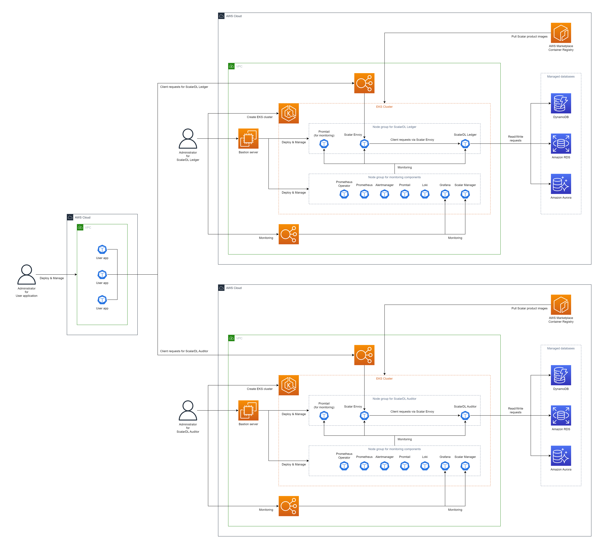
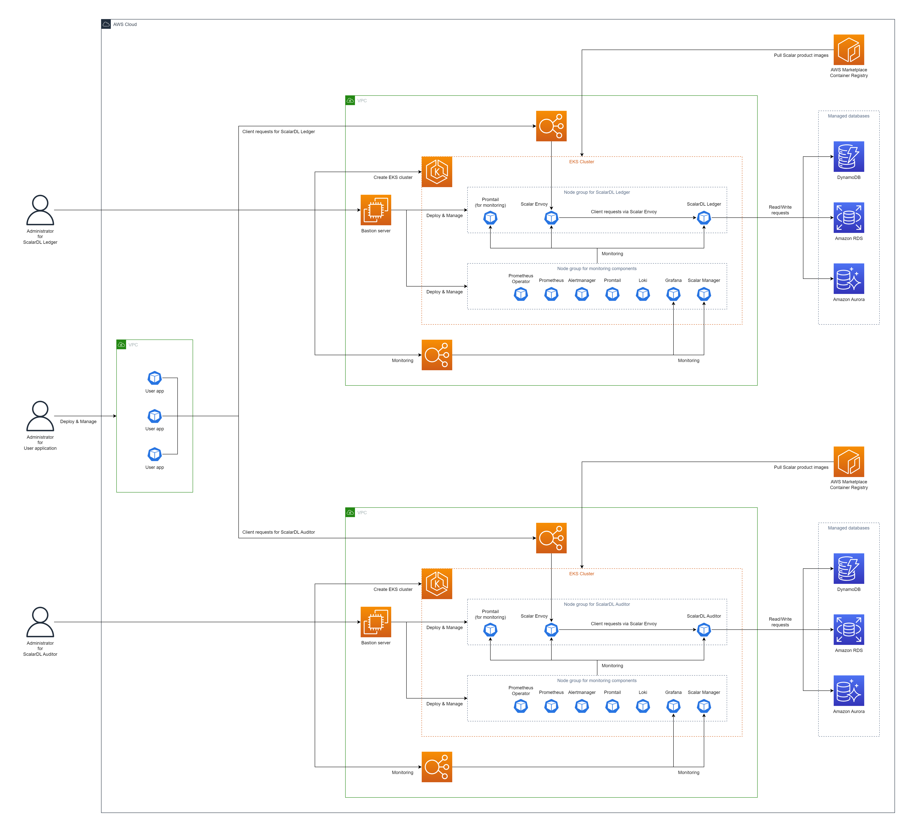
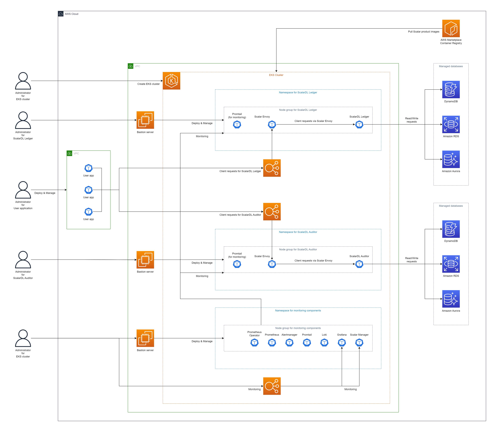

# Deploy ScalarDL Ledger and ScalarDL Auditor on Amazon Elastic Kubernetes Service (EKS)

This guide explains how to deploy ScalarDL Ledger and ScalarDL Auditor on Amazon Elastic Kubernetes Service (EKS).

In this guide, you will create one of the following three environments in your AWS environment. To make Byzantine fault detection work properly, we recommend deploying ScalarDL Ledger and ScalarDL Auditor on different administrative domains (i.e., separate environments).

* Use different AWS accounts (most recommended way)

  

* Use different Amazon Virtual Private Clouds (VPCs) (second recommended way)

  

* Use different namespaces (third recommended way)

  

**Note:** This guide follows the second recommended way, "Use different VPCs."

## Step 1. Subscribe to ScalarDL Ledger and ScalarDL Auditor in AWS Marketplace

You must get the ScalarDL Ledger and ScalarDL Auditor container images from [AWS Marketplace](https://aws.amazon.com/marketplace/seller-profile?id=bd4cd7de-49cd-433f-97ba-5cf71d76ec7b) and subscribe to ScalarDL Ledger and ScalarDL Auditor. For details on how to subscribe to ScalarDL Ledger and ScalarDL Auditor in AWS Marketplace, see [Subscribe to Scalar products from AWS Marketplace](./AwsMarketplaceGuide.md#subscribe-to-scalar-products-from-aws-marketplace).

## Step 2. Create an EKS cluster for ScalarDL Ledger

You must create an EKS cluster for the ScalarDL Ledger deployment. For details, see [Guidelines for creating an Amazon EKS cluster for Scalar products](./CreateEKSClusterForScalarProducts.md).

## Step 3. Create an EKS cluster for ScalarDL Auditor

You must also create an EKS cluster for the ScalarDL Auditor deployment. For details, see [Guidelines for creating an Amazon EKS cluster for Scalar products](./CreateEKSClusterForScalarProducts.md).

## Step 4. Set up a database for ScalarDL Ledger

You must prepare a database before deploying ScalarDL Ledger. Because ScalarDL Ledger uses ScalarDB internally to access databases, refer to [ScalarDB Supported Databases](https://github.com/scalar-labs/scalardb/blob/master/docs/scalardb-supported-databases.md) to see which types of databases ScalarDB supports.

For details on setting up a database, see [Set up a database for ScalarDB/ScalarDL deployment on AWS](./SetupDatabaseForAWS.md).

## Step 5. Set up a database for ScalarDL Auditor

You must also prepare a database before deploying ScalarDL Auditor. Because ScalarDL Auditor uses ScalarDB internally to access databases, refer to [ScalarDB Supported Databases](https://github.com/scalar-labs/scalardb/blob/master/docs/scalardb-supported-databases.md) to see which types of databases ScalarDB supports.

For details on setting up a database, see [Set up a database for ScalarDB/ScalarDL deployment on AWS](./SetupDatabaseForAWS.md).

## Step 6. Create a bastion server for ScalarDL Ledger

To execute some tools for deploying and managing ScalarDL Ledger on EKS, you must prepare a bastion server in the same VPC of the EKS cluster that you created in **Step 2**. For details, see [Create a Bastion Server](./CreateBastionServer.md).

## Step 7. Create a bastion server for ScalarDL Auditor

To execute some tools for deploying and managing ScalarDL Auditor on EKS, you must prepare a bastion server in the same VPC of the EKS cluster that you created in **Step 3**. For details, see [Create a Bastion Server](./CreateBastionServer.md).

## Step 8. Create network peering between two EKS clusters

To make ScalarDL work properly, ScalarDL Ledger and ScalarDL Auditor need to connect to each other. You must connect two VPCs by using [VPC peering](https://docs.aws.amazon.com/vpc/latest/peering/create-vpc-peering-connection.html). For details, see [Configure network peering for ScalarDL Auditor mode](./NetworkPeeringForScalarDLAuditor.md).

## Step 9. Prepare custom values files for the Scalar Helm Charts for ScalarDL Ledger and ScalarDL Schema Loader

To perform tasks, like accessing information in the database that you created in **Step 4**, you must configure custom values files for the Scalar Helm Charts for ScalarDL Ledger and ScalarDL Schema Loader (for Ledger) based on your environment. For details, see [Configure a custom values file for Scalar Helm Charts](https://github.com/scalar-labs/helm-charts/blob/main/docs/configure-custom-values-file.md).

## Step 10. Deploy ScalarDL Ledger by using the Scalar Helm Chart

Deploy ScalarDL Ledger in your EKS cluster by using the Helm Chart for ScalarDL Ledger. For details, see [Deploy Scalar products using Scalar Helm Charts](https://github.com/scalar-labs/helm-charts/blob/main/docs/how-to-deploy-scalar-products.md).

**Note:** We recommend creating a dedicated namespace by using the `kubectl create ns scalardl-ledger` command and deploying ScalarDL Ledger in the namespace by using the `-n scalardl-ledger` option with the `helm install` command.

## Step 11. Prepare custom values files for the Scalar Helm Charts for both ScalarDL Auditor and ScalarDL Schema Loader

To perform tasks, like accessing information in the database that you created in **Step 5**, you must configure custom values files for the Scalar Helm Charts for both ScalarDL Auditor and ScalarDL Schema Loader (for Auditor) based on your environment. For details, see [Configure a custom values file for Scalar Helm Charts](https://github.com/scalar-labs/helm-charts/blob/main/docs/configure-custom-values-file.md).

## Step 12. Deploy ScalarDL Auditor by using the Scalar Helm Chart

Deploy ScalarDL Auditor in your EKS cluster by using the Helm Chart for ScalarDL Auditor. For details , see [Deploy Scalar products using Scalar Helm Charts](https://github.com/scalar-labs/helm-charts/blob/main/docs/how-to-deploy-scalar-products.md).

**Note:** We recommend creating a dedicated namespace by using the `kubectl create ns scalardl-auditor` command and deploying ScalarDL Auditor in the namespace by using the `-n scalardl-auditor` option with the `helm install` command.

## Step 13. Check the status of your ScalarDL Ledger deployment

After deploying ScalarDL Ledger in your EKS cluster, you must check the status of each component. For details, see [Components to Regularly Check When Running in a Kubernetes Environment](./RegularCheck.md) for more details.

## Step 14. Check the status of your ScalarDL Auditor deployment

After deploying ScalarDL Auditor on your EKS cluster, you need to check the status of each component. See [Components to Regularly Check When Running in a Kubernetes Environment](./RegularCheck.md) for more details.

## Step 15. Monitor your ScalarDL Ledger deployment

After deploying ScalarDL Ledger in your EKS cluster, we recommend monitoring the deployed components and collecting their logs, especially in production. For details, see [Monitoring Scalar products on a Kubernetes cluster](./K8sMonitorGuide.md) and [Collecting logs from Scalar products on a Kubernetes cluster](./K8sLogCollectionGuide.md).

## Step 16. Monitor your ScalarDL Auditor deployment

After deploying ScalarDL Auditor in your EKS cluster, we recommend monitoring the deployed components and collecting their logs, especially in production. For details, see [Monitoring Scalar products on a Kubernetes cluster](./K8sMonitorGuide.md) and [Collecting logs from Scalar products on a Kubernetes cluster](./K8sLogCollectionGuide.md).

## Remove ScalarDL Ledger and ScalarDL Auditor from EKS

If you want to remove the environment you created, please remove all the resources in reverse order from which you created them in.
