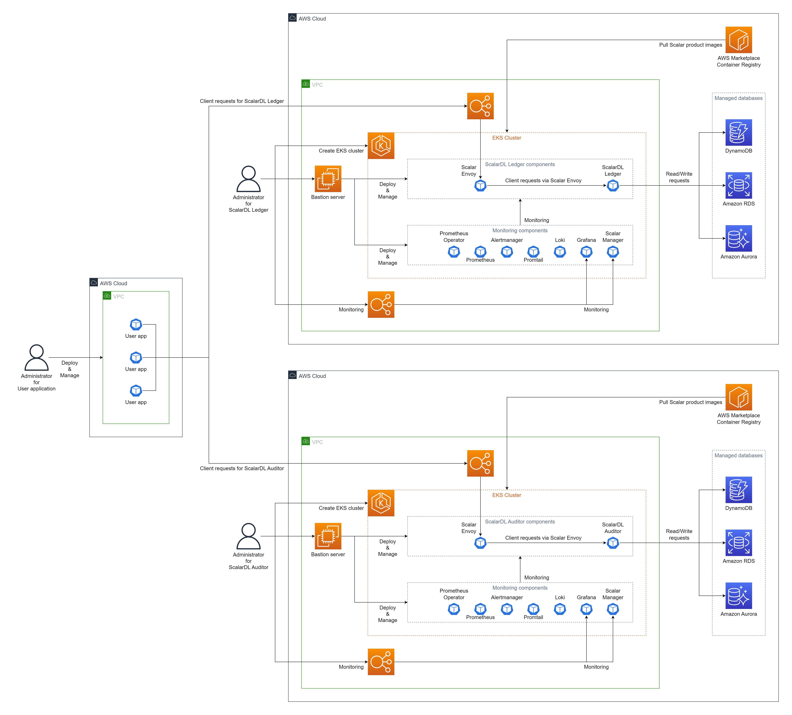

# Deploy ScalarDL Ledger and ScalarDL Auditor on Amazon EKS (Amazon Elastic Kubernetes Service)

This guide explains how to deploy ScalarDL Ledger and ScalarDL Auditor on Amazon Elastic Kubernetes Service (EKS).

In this guide, you will create one of the following three environments in your AWS environment. To make Byzantine fault detection work properly, we recommend deploying ScalarDL Ledger and ScalarDL Auditor on different administrative domains (i.e., separate environments).

* Use different AWS accounts (most recommended way)
  

* Use different VPCs (second recommended way)
  

* Use different namespaces (third recommended way)
  

Note: In this guide, we assume that the "Different VPCs" for the explanation.

## Step 1. Subscribe to ScalarDL Ledger and ScalarDL Auditor in AWS Marketplace

You can get the container images from [AWS Marketplace](https://aws.amazon.com/marketplace/seller-profile?id=bd4cd7de-49cd-433f-97ba-5cf71d76ec7b).

* [AWS Marketplace (ScalarDL Ledger)](https://aws.amazon.com/marketplace/pp/prodview-3jdwfmqonx7a2)
* [AWS Marketplace (ScalarDL Auditor)](https://aws.amazon.com/marketplace/pp/prodview-tj7svy75gu7m6)

First, you need to subscribe to them. For more details on how to subscribe to ScalarDL Ledger and ScalarDL Auditor in AWS Marketplace, see [Subscribe to Scalar products from AWS Marketplace - How to install Scalar products through AWS Marketplace](./AwsMarketplaceGuide.md#subscribe-to-scalar-products-from-aws-marketplace).

## Step 2. Create an EKS cluster for ScalarDL Ledger

Create an EKS cluster for the deployment of ScalarDL Ledger. See [Create an Amazon EKS cluster for Scalar products](./CreateEKSClusterForScalarProducts.md) for more details.

## Step 3. Create an EKS cluster for ScalarDL Auditor

Create an EKS cluster for the deployment of ScalarDL Auditor. See [Create an Amazon EKS cluster for Scalar products](./CreateEKSClusterForScalarProducts.md) for more details.

## Step 4. Set up a database for ScalarDL Ledger

ScalarDL Ledger uses ScalarDB in its internal to access a database and ScalarDB supports [several databases](https://github.com/scalar-labs/scalardb/blob/master/docs/scalardb-supported-databases.md). You need to prepare a database before you deploy ScalarDL Ledger. See [Set up a database for ScalarDB/ScalarDL deployment on AWS](./SetupDatabaseForAWS.md) for more details.

## Step 5. Set up a database for ScalarDL Auditor

ScalarDL Auditor uses ScalarDB in its internal to access a database and ScalarDB supports [several databases](https://github.com/scalar-labs/scalardb/blob/master/docs/scalardb-supported-databases.md). You need to prepare a database before you deploy ScalarDL Auditor. See [Set up a database for ScalarDB/ScalarDL deployment on AWS](./SetupDatabaseForAWS.md) for more details.

## Step 6. Create a bastion server for ScalarDL Ledger

For executing some tools to deploy and manage ScalarDL Ledger on EKS, you need to prepare a bastion server in the same VPC of the EKS cluster you created in **Step 2**. See [Create a bastion server](./CreateBastionServer.md) for more details.

## Step 7. Create a bastion server for ScalarDL Auditor

For executing some tools to deploy and manage ScalarDL Auditor on EKS, you need to prepare a bastion server in the same VPC of the EKS cluster you created in **Step 3**. See [Create a bastion server](./CreateBastionServer.md) for more details.

## Step 8. Create network peering between two EKS clusters

To make ScalarDL work properly, ScalarDL Ledger and ScalarDL Auditor need to connect with each other. You need to connect two VPCs using [VPC Peering](https://docs.aws.amazon.com/vpc/latest/peering/create-vpc-peering-connection.html). See [Configure network peering for ScalarDL Auditor mode](./NetworkPeeringForScalarDLAuditor.md) fro more details.

## Step 9. Prepare a custom values file of Helm Chart of ScalarDL Ledger

You need to configure a custom values file for the Helm Chart of ScalarDL Ledger and ScalarDL Schema Loader (for Ledger) based on your environment (e.g., access information of the database you created in **Step 4**). See [Configure a custom values file for Scalar Helm Charts](https://github.com/scalar-labs/helm-charts/blob/main/docs/configure-custom-values-file.md) for more details.

## Step 10. Deploy ScalarDL Ledger using Scalar Helm Chart

Deploy ScalarDL Ledger on your EKS cluster using Scalar Helm Chart. See [Deploy Scalar products using Scalar Helm Charts](https://github.com/scalar-labs/helm-charts/blob/main/docs/how-to-deploy-scalar-products.md) for more details.

Note: We recommend creating a dedicated namespace by using the `kubectl create ns scalardl-ledger` command and deploying ScalarDL Ledger in the namespace by using the `-n scalardl-ledger` option with the `helm install` command.

## Step 11. Prepare a custom values file of Helm Chart of ScalarDL Auditor

You need to configure a custom values file for the Helm Chart of ScalarDL Auditor and ScalarDL Schema Loader (for Auditor) based on your environment (e.g., access information of the database you created in **Step 5**). See [Configure a custom values file for Scalar Helm Charts](https://github.com/scalar-labs/helm-charts/blob/main/docs/configure-custom-values-file.md) for more details.

## Step 12. Deploy ScalarDL Auditor using Scalar Helm Chart

Deploy ScalarDL Auditor on your EKS cluster using Scalar Helm Chart. See [Deploy Scalar products using Scalar Helm Charts](https://github.com/scalar-labs/helm-charts/blob/main/docs/how-to-deploy-scalar-products.md) for more details.

Note: We recommend creating a dedicated namespace by using the `kubectl create ns scalardl-auditor` command and deploying ScalarDL Auditor in the namespace by using the `-n scalardl-auditor` option with the `helm install` command.

## Step 13. Check the status of ScalarDL Ledger deployment

After deploying ScalarDL Ledger on your EKS cluster, you need to check the status of each component. See [What you might want to check on a regular basis](./RegularCheck.md) for more details.

## Step 14. Check the status of ScalarDL Auditor deployment

After deploying ScalarDL Auditor on your EKS cluster, you need to check the status of each component. See [What you might want to check on a regular basis](./RegularCheck.md) for more details.

## Step 15. Monitoring for ScalarDL Ledger deployment

After deploying ScalarDL Ledger on your EKS cluster, we recommend monitoring the deployed components and collecting their logs, especially in production. See [Monitoring Scalar products on a Kubernetes cluster](./K8sMonitorGuide.md) and [Collecting logs from Scalar products on a Kubernetes cluster](./K8sLogCollectionGuide.md) for more details.

## Step 16. Monitoring for ScalarDL Auditor deployment

After deploying ScalarDL Auditor on your EKS cluster, we recommend monitoring the deployed components and collecting their logs, especially in production. See [Monitoring Scalar products on a Kubernetes cluster](./K8sMonitorGuide.md) and [Collecting logs from Scalar products on a Kubernetes cluster](./K8sLogCollectionGuide.md) for more details.

---

## Uninstall ScalarDL Ledger and ScalarDL Auditor on EKS

If you want to uninstall the environment you created, please uninstall/remove resources in the reverse order of creation.
