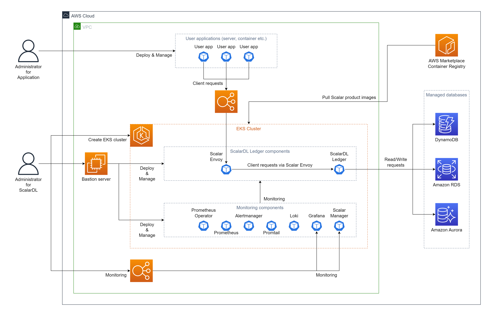

# Deploy ScalarDL Ledger on Amazon EKS (Amazon Elastic Kubernetes Service)

This document explains how to deploy **ScalarDL Ledger** on Amazon Elastic Kubernetes Service (EKS).

In this guide, you will create the following environment in your AWS environment account.

## Step 1. Subscribe to ScalarDL Ledger in AWS Marketplace

You can get the ScalarDL Ledger container image from [AWS Marketplace](https://aws.amazon.com/marketplace/pp/prodview-3jdwfmqonx7a2). First, you need to subscribe to it. For more details on how to subscribe to ScalarDL Ledger in AWS Marketplace, see [Subscribe to Scalar products from AWS Marketplace - How to install Scalar products through AWS Marketplace](./AwsMarketplaceGuide.md#subscribe-to-scalar-products-from-aws-marketplace).

## Step 2. Create an EKS cluster

Create an EKS cluster for the deployment of ScalarDL Ledger. See [Create an Amazon EKS cluster for Scalar products](./CreateEKSClusterForScalarProducts.md) for more details.

## Step 3. Set up a database for ScalarDL Ledger

ScalarDL Ledger uses ScalarDB in its internal to access a database and ScalarDB supports [several databases](https://github.com/scalar-labs/scalardb/blob/master/docs/scalardb-supported-databases.md). You need to prepare a database before you deploy ScalarDL Ledger. See [Set up a database for ScalarDB/ScalarDL deployment on AWS](./SetupDatabaseForAWS.md) for more details.

## Step 4. Create a bastion server

For executing some tools to deploy and manage ScalarDL Ledger on EKS, you need to prepare a bastion server in the same VPC of the EKS cluster you created in **Step 2**. See [Create a bastion server](./CreateBastionServer.md) for more details.

## Step 5. Prepare a custom values file of Helm 

You need to configure a custom values file for the Helm Chart of ScalarDL Ledger and ScalarDL Schema Loader based on your environment (e.g., access information of the database you created in **Step 3**). See [Configure a custom values file for Scalar Helm Charts](https://github.com/scalar-labs/helm-charts/blob/main/docs/configure-custom-values-file.md) for more details.

## Step 6. Deploy ScalarDL Ledger using Scalar Helm Chart

Deploy ScalarDL Ledger on your EKS cluster using Scalar Helm Chart. See [Deploy Scalar products using Scalar Helm Charts](https://github.com/scalar-labs/helm-charts/blob/main/docs/how-to-deploy-scalar-products.md) for more details.

Note: We recommend creating a dedicated namespace by using the `kubectl create ns scalardl-ledger` command and deploying ScalarDL Ledger in the namespace by using the `-n scalardl-ledger` option with the `helm install` command.

## Step 7. Check the status of ScalarDL Ledger deployment

After deploying ScalarDL Ledger on your EKS cluster, you need to check the status of each component. See [What you might want to check on a regular basis](./RegularCheck.md) for more details.

## Step 8. Monitoring for ScalarDL Ledger deployment

After deploying ScalarDL Ledger on your EKS cluster, we recommend monitoring the deployed components and collecting their logs, especially in production. See [Monitoring Scalar products on a Kubernetes cluster](./K8sMonitorGuide.md) and [Collecting logs from Scalar products on a Kubernetes cluster](./K8sLogCollectionGuide.md) for more details.

---

## Uninstall ScalarDL Ledger on EKS

If you want to uninstall the environment you created, please uninstall/remove resources in the reverse order of creation.
