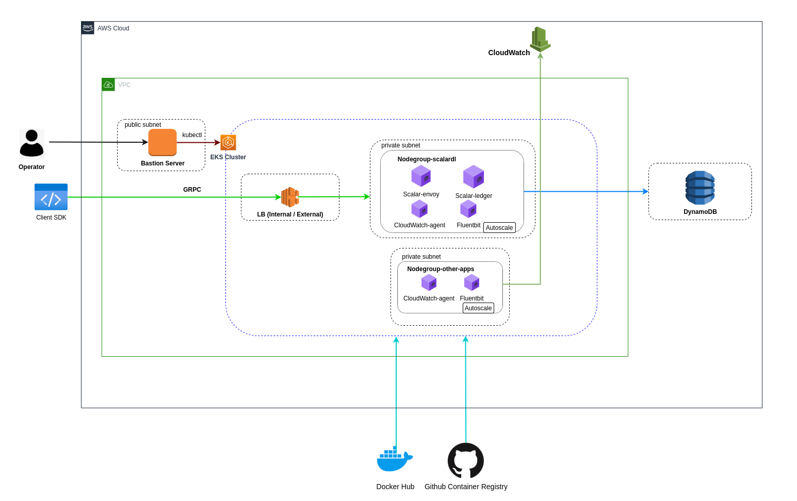

# Deploy Scalar DL on AWS

Scalar DL is a database-agnostic distributed ledger middleware containerized with Docker. 
It can be deployed on various platforms and it is recommended to be deployed on managed services for production to achieve high availability and scalability, and maintainability. 
This guide shows you how to manually deploy Scalar DL on a managed database service and a managed Kubernetes service in Amazon Web Services (AWS) as a starting point of deploying Scalar DL for production.

## What we create



In this guide, we will create the following components.

* A VPC with NAT gateway
* An EKS cluster with two Kubernetes node groups
* A managed database service (you can choose one of them)
    * DynamoDB
    * RDS (MySQL/PostgreSQL)
* 1 Bastion instance with a public IP
* Amazon CloudWatch

## Step 1. Configure your network

Configure a secure network with your organizational or application standards. 
Scalar DL handles highly sensitive data of your application, so you should create a highly secure network for production. This section will help you to configure a secure network for Scalar DL deployments.

> **REQUIREMENTS:**
> 
> * You must have a VPC, with NAT gateways on private subnets. NAT gateway is necessary to enable internet access for Kubernetes node group subnets.
> * You must have at least 2 subnets in different AZs for the Kubernetes cluster. This is mandatory to create an EKS cluster.
> * You must have at least one private subnet for the managed database.
> * You must create subnets with the prefix at least _/24_ for the Kubernetes cluster to work without issues even after scaling. 


> **RECOMMENDATIONS:**
>
> * Kubernetes should be private in production and should provide secure access with SSH or VPN. You can use a bastion server as a host machine for secure access to the private network.
> * Subnets should be in multiple availability zones, to enable fault tolerance for the production use.
> * Kubernetes cluster should be public to enable the envoy public endpoint. The Kubernetes cluster in public is not recommended for production.

[Create an Amazon VPC](https://docs.aws.amazon.com/directoryservice/latest/admin-guide/gsg_create_vpc.html) with the above requirements and recommendations along with your organizational or application standards.

## Step 2. Set up a Scalar DL supported database 

Scalar DL can run on various databases, which is an essential component for underlying storage. This section will help you to set up a Scalar DL supported database.

> **REQUIREMENTS:**
>
> * You must have a Scalar DL supported managed database.

Follow the [Set up a Scalar DL supported database](ScalarDLSupportedDatabase.md) document.

## Step 3. Configure EKS

Amazon EKS automatically manages the availability and scalability of the Kubernetes control plane nodes, so it will help you to achieve the high availability and scalability of Scalar DL. 
This section will help you to configure a Kubernetes service for Scalar DL deployment.

### Prerequisites
Install the following tools on your host machine:
* [awscli](https://docs.aws.amazon.com/cli/latest/userguide/install-cliv2-linux.html#cliv2-linux-install): In this tutorial, awscli is used to create a kubeconfig file to access the EKS cluster.
* [kubectl](https://kubernetes.io/docs/tasks/tools/): Kubernetes command-line tool to manage EKS cluster. Kubectl 1.19 or higher is required.

### Create a Kubernetes cluster	

Kubernetes cluster is a primary component of EKS. Scalar DL requires a single EKS cluster for deploying ledger, envoy and monitor services. This section will help you to create an EKS cluster. 

> **REQUIREMENTS:**
>
> * You must have an EKS cluster with Kubernetes version 1.19 or above in order to use our most up-to-date configuration files.

[Create an Amazon EKS cluster](https://docs.aws.amazon.com/eks/latest/userguide/create-cluster.html) with the above requirements.

### Create managed node groups

This section will help you to create two managed node groups for Scalar DL deployment. 
One managed node group dedicated to Ledger and Envoy deployment, and another managed node group for logs and metrics collection.

> **REQUIREMENTS:**
>
> * Kubernetes node group must be labeled with key as `agentpool` and value as `scalardlpool` for ledger and envoy deployment.
 
> **RECOMMENDATIONS:**
>
> * Kubernetes node size should be `m5.large` for deploying `ledger` and `envoy` pods, Because each node requires 2 vcpu and 8gb ram for deploying ledger and envoy pods.
> * Node groups should have at least 3 nodes for high availability in production.

[Create a managed node group](https://docs.aws.amazon.com/eks/latest/userguide/create-managed-node-group.html) with the above requirements and recommendations.

## Step 4. Install Scalar DL

Scalar DL is a blockchain-inspired tamper-evident distributed ledger software. 
It executes scalable and highly available ACID-compliant smart contracts with digital signatures in the form of distributed transactions. 
This section will help you to install Scalar DL to the EKS cluster with [Helm charts](https://github.com/scalar-labs/helm-charts.git).

### Prerequisites

Install the following tools on your host machine:

* [helm](https://helm.sh/docs/intro/install/): helm command-line tool to manage releases in the EKS cluster. In this tutorial, it is used to deploy Scalar DL and Schema loading helm charts to the EKS cluster. Helm version 3.5 or latest is required.

> **REQUIREMENTS:**
>
> * You must have the authority to pull `scalar-ledger` and `scalardl-schema-loader` container images.
> * You must configure the database properties in the helm chart custom values file.
> * You must confirm that the node group Kubernetes label matches the label in the helm chart [custom values](https://github.com/scalar-labs/scalar-kubernetes/tree/master/conf) file.

### Deploy Scalar DL

Following steps will help you to install Scalar DL on EKS:

1. Download the following Scalar DL configuration files and update the database configuration in `scalarLedgerConfiguration` and `schemaLoading` sections
    * [scalardl-custom-values.yaml](https://raw.githubusercontent.com/scalar-labs/scalar-kubernetes/master/conf/scalardl-custom-values.yaml)
    * [schema-loading-custom-values.yaml](https://raw.githubusercontent.com/scalar-labs/scalar-kubernetes/master/conf/schema-loading-custom-values.yaml)
2. Create the docker-registry secret for pulling the Scalar DL images from the GitHub registry
    ```
    $ kubectl create secret docker-registry reg-docker-secrets --docker-server=ghcr.io --docker-username=<github-username> --docker-password=<github-personal-access-token>
    ```
3. Run the helm commands on the host machine to install Scalar DL on EKS
    ```
    # Add helm charts 
    $ helm repo add scalar-labs https://scalar-labs.github.io/helm-charts
    
    # Load Schema for Scalar DL install with a release name `load-schema`
    $ cd ${SCALAR_K8S_HOME}
    $ helm upgrade --install load-schema scalar-labs/schema-loading --namespace default -f schema-loading-custom-values.yaml
    
    # Install Scalar DL with a release name `my-release-scalardl`
    $ cd ${SCALAR_K8S_HOME}
    $ helm upgrade --install my-release-scalardl scalar-labs/scalardl --namespace default -f scalardl-custom-values.yaml
    ```

**Note:**

* The same commands can be used to upgrade the pods.
* Release name `my-release-scalardl` can be changed as per your convenience.
* `helm ls -a` command can be used to list currently installed releases.
* You must confirm the load-schema deployment has been completed with `kubectl get po -o wide` before installing Scalar DL.
* Follow the [Advanced Scalar DL Configuration](#advanced-scalar-dl-configuration) section for more customization.

## Step 5. Monitor the Cluster

It is critical to actively monitor the overall health and performance of a cluster running in production. 
You can use container insights to collect performance metrics and Fluent Bit to collect logs of the EKS cluster. 
This section will help you to configure monitoring and logging for your EKS cluster.

> **RECOMMENDATIONS:**
>
> * Monitoring should be enabled for EKS in production.
> * CloudWatch agent should be configured in the EKS cluster for collecting metrics from pods.
> * Fluent Bit should be configured in the EKS cluster for collecting logs from pods.
>   * Node instance role should have CreateLogGroup permission for Fluent bit.

### Setup container insights

CloudWatch Container Insights helps you to collect, aggregate, and summarize metrics and logs from your containerized applications, so you can set up a cloudwatch agent in the node group created for log and metrics collection.

[Setup cloudwatch agent to collect cluster metrics](https://docs.aws.amazon.com/AmazonCloudWatch/latest/monitoring/Container-Insights-setup-metrics.html) will help you to collect metrics from your containers.

### Setup the Fluent Bit

Fluent Bit allows you to collect any data like metrics and logs from different sources, so you can set up the Fluent Bit in the node group created for log and metrics collection.

[Setting up Fluent Bit](https://github.com/scalar-labs/misc/blob/scalar-dl-manual-deployment-doc-for-eks/manual-deployment-guide/DeployScalarDLonAWS.md)  will help you to collect logs from containers.

## Step 6. Checklist for confirming Scalar DL deployments

After the Scalar DL deployment, you need to confirm that deployment has been completed successfully. This section will help you to confirm the deployment.

### Confirm Scalar DL deployment

You can check if the pods and the services are properly deployed by running the `kubectl get po,svc,endpoints -o wide` command on the bastion host

* Make sure the load balancer's private endpoint (EXTERNAL-IP) is created properly.
* Make sure the ledger and envoy pods are running properly.
* Make sure the schema loading pod execution is completed properly.
* Make sure the schema is properly created in the underlying database service.

### Confirm EKS cluster monitoring

* Confirm the EKS cluster metrics are available in CloudWatch `Container Insights`.
* Confirm the Container logs are available in CloudWatch `Log`.

### Confirm Database monitoring

* Confirm the database metrics are available in CloudWatch metrics.

## Advanced Scalar DL configuration

Scalar DL provides customization based on your requirements. You can customize the following features based on your convenience.

### Increase the number of Envoy Pods

You can increase the number of envoy pods based on your requirements. The following steps will help you to achieve it:

In `scalardl-custom-values.yaml`, you can update the number of `replicaCount` to the desired number of pod

edit `scalardl-custom-values.yaml`

```
envoy:
  replicaCount: 6
```

The number of deployable pods depends on the number of available nodes. So, you may need to increase the number of nodes from the AWS console.

### Increase the resource of Envoy Pods

You can increase the resource of envoy pods based on your requirements. The following steps will help you to achieve it:

In `scalardl-custom-values.yaml`, you can update resource as follow

edit `scalardl-custom-values.yaml`

```
envoy:
  resources:
    requests:
      cpu: 400m
      memory: 256Mi
    limits:
      cpu: 500m
      memory: 328Mi
```
More information can be found in [the official documentation](https://kubernetes.io/docs/concepts/configuration/manage-resources-containers/#resource-requests-and-limits-of-pod-and-container)

### Expose Envoy endpoint to public

Scalar DL supports both public and private endpoints. The public endpoint allows you to access Scalar DL from outside the network so you can deploy your application outside the Scalar DL network. 
The private endpoint allows you to access Scalar DL from within the network so you can deploy your application within the Scalar DL network or you can connect another VPC to the Scalar DL network using VPC peering.

In `scalardl-custom-values.yaml`, you can update the `aws-load-balancer-internal` as false to expose `Envoy`

```
envoy:
  service:
    type: LoadBalancer
    annotations:
      service.beta.kubernetes.io/aws-load-balancer-internal: "false"
```

### Increase the number of Ledger Pods

You can increase the number of ledger pods based on your requirements. The following steps will help you to achieve it:

In `scalardl-custom-values.yaml`, you can update `replicaCount` to the desired number of pods.

edit `scalardl-custom-values.yaml`

```
ledger:
  replicaCount: 6
```

The number of deployable pods depends on the number of available nodes. You may need to increase the number of nodes from the AWS console.

### Increase the resource of Ledger Pods

You can increase the resource of ledger pods based on your requirements. The following steps will help you to achieve it:

In `scalardl-custom-values.yaml`, you can update resource as follow

edit `scalardl-custom-values.yaml`

```
ledger:
  resources:
    requests:
      cpu: 1500m
      memory: 2Gi
    limits:
      cpu: 1600m
      memory: 4Gi
```
More information can be found in the [official documentation](https://kubernetes.io/docs/concepts/configuration/manage-resources-containers/#resource-requests-and-limits-of-pod-and-container)

## Uninstall Scalar DL

You can uninstall Scalar DL installation with the following helm commands:

```console
# Uninstall loaded schema with a release name 'load-schema'
$ cd ${SCALAR_K8S_HOME}
$ helm delete load-schema

# Uninstall Scalar DL with a release name 'my-release-scalardl'
$ cd ${SCALAR_K8S_HOME}
$ helm delete my-release-scalardl
```
