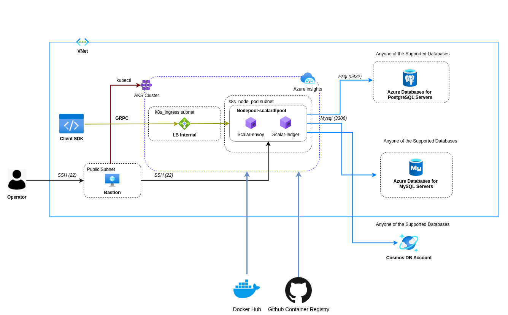

# Deploy Scalar DL on Azure

Scalar DL is a database-agnostic distributed ledger middleware containerized with Docker. 
It can be deployed on various platforms and is recommended to be deployed on managed services for production to achieve high availability and scalability, and maintainability. 
This guide shows you how to manually deploy Scalar DL on a managed database service and a managed Kubernetes service in Azure as a starting point of deploying Scalar DL for production.

## What we create



In this guide, we will create the following components.

* An Azure Virtual Network associated with Resource Group
* An AKS cluster with Kubernetes node pool
* A managed database service (you can choose one of them)
    * A Cosmos DB Account
* 1 Bastion instance with a public IP
* Azure monitor insights

## Step 1. Configure your network

Configure a secure network with your organizational or application standards. 
Scalar DL handles highly sensitive data of your application, so you should create a highly secure network for production. 
This section will help you to configure a secure network for Scalar DL deployments.

### Requirements

* You must create a subnet with the prefix at least `/22` for the Kubernetes cluster to work without issues even after scaling. 
* You must create a subnet with the name `k8s_ingress` to create an envoy load balancer.

### Recommendations

* Kubernetes should be private in production and should provide secure access with SSH or VPN. 
You can use a bastion server as a host machine for secure access to private networks.

## Step 2. Set up a database

In this section, you will set up a database for Scalar DL.

### Requirements

*  You must have a database that Scalar DL supports.

Follow the [Set up a database](SetupAzureDatabase.md) document.

## Step 3. Configure AKS

Azure AKS provides a scalable and highly-available Kubernetes control plane that runs across multiple availability zones, which helps you to achieve the high availability and scalability for Scalar DL. 
This section shows how to configure a Kubernetes service for Scalar DL deployment.

### Prerequisites
Install the following tools on your host machine:

* [azurecli](https://docs.microsoft.com/en-us/cli/azure/install-azure-cli-linux): In this tutorial, azurecli is used to create a kubeconfig file to access the AKS cluster.
* [kubectl](https://kubernetes.io/docs/tasks/tools/): Kubernetes command-line tool to manage AKS cluster. Kubectl 1.19 or higher is required.

### Requirements

* You must have an AKS cluster with Kubernetes version 1.19 or above in order to use our most up-to-date configuration files.
* Kubernetes node pool must be created with the name `scalardlpool` to deploy ledger and envoy pods.
* You must configure kubernetes access control to `k8s_ingress` subnet.
* You must create the Kubernetes cluster with `Service principal` as Authentication method.
* You must create the Kubernetes cluster with `Azure CNI`.

### Recommendations

* Kubernetes node size should be `Standard D2s v3` to deploy the ledger and envoy pods because each node requires 2 vCPU and 8GB ram for deploying ledger and envoy pods.
* Node pool should have at least 3 nodes for high availability in production.

### Create a Kubernetes Cluster

Create a Kubernetes cluster with a node pool to deploy the ledger and envoy. This section will help you to create an AKS cluster.

[Create an AKS cluster](https://docs.microsoft.com/en-us/azure/aks/kubernetes-walkthrough-portal#create-an-aks-cluster) with the above requirements and recommendations.

* Configure kubectl to connect to your Kubernetes cluster using the `az aks get-credentials` command. 
The following command downloads credentials and configures the Kubernetes CLI to use them from the host machine.

```
$ az aks get-credentials --resource-group myResourceGroup --name myAKSCluster
```

## Step 4. Install Scalar DL

After creating Kubernetes cluster next step is to deploy Scalar DL into the AKS cluster. 
This section shows how to install Scalar DL to the AKS cluster with Helm charts.

### Prerequisites

Install the following tool on your host machine:

* [helm](https://helm.sh/docs/intro/install/): helm command-line tool to manage releases in the AKS cluster. In this tutorial, it is used to deploy Scalar DL and Schema loading helm charts to the AKS cluster. Helm version 3.2.1 or latest is required. 

### Requirements

* You must have the authority to pull scalar-ledger and scalardl-schema-loader container images.
* You must configure the database properties in the helm chart custom values file.
* You must confirm that replica count of the ledger and envoy pods in the scalardl-custom-values file is equal to the number of nodes.


### Deploy Scalar DL

Following steps will help you to install Scalar DL on AKS:

1. Download the following Scalar DL configuration files and update the database configuration in `scalarLedgerConfiguration` and `schemaLoading` sections
    * [scalardl-custom-values.yaml](https://raw.githubusercontent.com/scalar-labs/scalar-kubernetes/master/conf/scalardl-custom-values.yaml)
    * [schema-loading-custom-values.yaml](https://raw.githubusercontent.com/scalar-labs/scalar-kubernetes/master/conf/schema-loading-custom-values.yaml)
2. Create the docker-registry secret for pulling the Scalar DL images from the GitHub registry
    ```
    $ kubectl create secret docker-registry reg-docker-secrets --docker-server=ghcr.io --docker-username=<github-username> --docker-password=<github-personal-access-token>
    ```
3. Run the helm commands on the host machine to install Scalar DL on AKS
    ```
    # Add helm charts 
    $ helm repo add scalar-labs https://scalar-labs.github.io/helm-charts
    
    # List the Scalar charts.
    $ helm search repo scalar-labs
    
    # Load Schema for Scalar DL install with a release name `load-schema`
    $ helm upgrade --install load-schema scalar-labs/schema-loading --namespace default -f schema-loading-custom-values.yaml
    
    # Install Scalar DL with a release name `my-release-scalardl`
    $ helm upgrade --install my-release-scalardl scalar-labs/scalardl --namespace default -f scalardl-custom-values.yaml
    ```

Note:

* The same commands can be used to upgrade the pods.
* Release name `my-release-scalardl` can be changed as per your convenience.
* `helm ls -a` command can be used to list currently installed releases.
* You should confirm the load-schema deployment has been completed with `kubectl get po -o wide` before installing Scalar DL.
* Follow the [Maintain the cluster](#maintain-the-cluster) section for more customization.

## Step 5. Monitor the cluster

It is critical to actively monitor the overall health and performance of a cluster running in production. 
This section will help you to configure monitoring and logging for your AKS cluster.

### Recommendation

* Monitoring should be enabled for AKS in production.

### Set up container insights for AKS cluster

Enable container insights for monitoring. 

Follow the [Enable monitoring of Azure Kubernetes Service (AKS) cluster already deployed](https://docs.microsoft.com/en-us/azure/azure-monitor/containers/container-insights-enable-existing-clusters) document.

After the Scalar DL deployment, you need to confirm that deployment has been completed successfully. This section will help you to confirm the deployment.

### Confirm Scalar DL deployment

* You can check if the pods and the services are properly deployed by running the `kubectl get po,svc,endpoints -o wide` command on the host machine.

```
$ kubectl get po,svc,endpoints -o wide
NAME                                              READY   STATUS    RESTARTS   AGE     IP          NODE                                   NOMINATED NODE   READINESS GATES
pod/load-schema-schema-loading-bgr4x              0/1     Completed 0          3m6s    10.2.0.51   aks-scalardlpool-16372315-vmss000001   <none>           <none>
pod/my-release-scalardl-envoy-7598cc45dd-cdvg2    1/1     Running   0          2m28s   10.2.0.42   aks-scalardlpool-16372315-vmss000000   <none>           <none>
pod/my-release-scalardl-envoy-7598cc45dd-dz5v2    1/1     Running   0          2m28s   10.2.0.63   aks-scalardlpool-16372315-vmss000002   <none>           <none>
pod/my-release-scalardl-envoy-7598cc45dd-nhz72    1/1     Running   0          2m29s   10.2.0.52   aks-scalardlpool-16372315-vmss000001   <none>           <none>
pod/my-release-scalardl-ledger-5474bdfc6c-slwv7   1/1     Running   0          2m29s   10.2.0.45   aks-scalardlpool-16372315-vmss000000   <none>           <none>
pod/my-release-scalardl-ledger-5474bdfc6c-v4m8g   1/1     Running   0          2m29s   10.2.0.51   aks-scalardlpool-16372315-vmss000001   <none>           <none>
pod/my-release-scalardl-ledger-5474bdfc6c-x9xl4   1/1     Running   0          2m29s   10.2.0.62   aks-scalardlpool-16372315-vmss000002   <none>           <none>

NAME                                          TYPE           CLUSTER-IP     EXTERNAL-IP   PORT(S)                           AGE     SELECTOR
service/kubernetes                            ClusterIP      10.0.0.1       <none>        443/TCP                           159m    <none>
service/my-release-scalardl-envoy             LoadBalancer   10.0.157.155   10.2.4.4      50051:30990/TCP,50052:30789/TCP   2m29s   app.kubernetes.io/app=envoy,app.kubernetes.io/instance=my-release-scalardl,app.kubernetes.io/name=scalardl
service/my-release-scalardl-envoy-metrics     ClusterIP      10.0.20.189    <none>        9001/TCP                          2m29s   app.kubernetes.io/app=envoy,app.kubernetes.io/instance=my-release-scalardl,app.kubernetes.io/name=scalardl
service/my-release-scalardl-ledger-headless   ClusterIP      None           <none>        50051/TCP,50053/TCP,50052/TCP     2m29s   app.kubernetes.io/app=ledger,app.kubernetes.io/instance=my-release-scalardl,app.kubernetes.io/name=scalardl

NAME                                            ENDPOINTS                                                     AGE
endpoints/kubernetes                            10.2.0.4:443                                                  159m
endpoints/my-release-scalardl-envoy             10.2.0.42:50052,10.2.0.52:50052,10.2.0.63:50052 + 3 more...   2m29s
endpoints/my-release-scalardl-envoy-metrics     10.2.0.42:9001,10.2.0.52:9001,10.2.0.63:9001                  2m29s
endpoints/my-release-scalardl-ledger-headless   10.2.0.45:50051,10.2.0.51:50051,10.2.0.62:50051 + 6 more...   2m29s
```

* Make sure the schema is properly created in the underlying database service.

### Confirm AKS cluster monitoring

* Follow the document to confirm the [Cluster insights](https://docs.microsoft.com/en-us/azure/azure-monitor/containers/container-insights-overview#how-do-i-access-this-feature).

### Confirm Database monitoring

* Follow the document to confirm the [Monitor Azure Cosmos DB](https://docs.microsoft.com/en-us/azure/cosmos-db/monitor-cosmos-db).

## Maintain the cluster

Scalar DL provides customization based on your requirements. You can customize the following features based on your convenience.

### Increase the number of Envoy Pods

You can increase the number of envoy pods based on your requirements. The following steps will help you to achieve it:

In `scalardl-custom-values.yaml`, you can update the number of `replicaCount` to the desired number of pod

edit `scalardl-custom-values.yaml`

```
envoy:
  replicaCount: 6
```

The number of deployable pods depends on the number of available nodes. So, you may need to increase the number of nodes from the Azure portal.

### Increase the resource of Envoy Pods

You can increase the resource of envoy pods based on your requirements. The following steps will help you to achieve it:

In `scalardl-custom-values.yaml`, you can update resource as follow

edit `scalardl-custom-values.yaml`

```
envoy:
  resources:
    requests:
      cpu: 400m
      memory: 256Mi
    limits:
      cpu: 500m
      memory: 328Mi
```
More information can be found in [the official documentation](https://kubernetes.io/docs/concepts/configuration/manage-resources-containers/#resource-requests-and-limits-of-pod-and-container).

### Expose Envoy endpoint to public

Scalar DL supports both public and private endpoints. The public endpoint allows you to access Scalar DL from outside the network so you can deploy your application outside the Scalar DL network. 
The private endpoint allows you to access Scalar DL from within the network so you can deploy your application within the Scalar DL network or you can connect another VPC to the Scalar DL network using VPC peering.

In `scalardl-custom-values.yaml`, you can update the `azure-load-balancer-internal` as false to expose `Envoy`

```
envoy:
  service:
    type: LoadBalancer
    annotations:
      service.beta.kubernetes.io/azure-load-balancer-internal: "false"
```

### Increase the number of Ledger Pods

You can increase the number of ledger pods based on your requirements. The following steps will help you to achieve it:

In `scalardl-custom-values.yaml`, you can update `replicaCount` to the desired number of pods.

edit `scalardl-custom-values.yaml`

```
ledger:
  replicaCount: 6
```

The number of deployable pods depends on the number of available nodes. You may need to increase the number of nodes from the Azure portal.

### Increase the resource of Ledger Pods

You can increase the resource of ledger pods based on your requirements. The following steps will help you to achieve it:

In `scalardl-custom-values.yaml`, you can update resource as follow

edit `scalardl-custom-values.yaml`

```
ledger:
  resources:
    requests:
      cpu: 1500m
      memory: 2Gi
    limits:
      cpu: 1600m
      memory: 4Gi
```
More information can be found in the [official documentation](https://kubernetes.io/docs/concepts/configuration/manage-resources-containers/#resource-requests-and-limits-of-pod-and-container).

## Uninstall Scalar DL

You can uninstall Scalar DL installation with the following helm commands:

```console
# Uninstall loaded schema with a release name 'load-schema'
$ helm delete load-schema

# Uninstall Scalar DL with a release name 'my-release-scalardl'
$ helm delete my-release-scalardl
```
