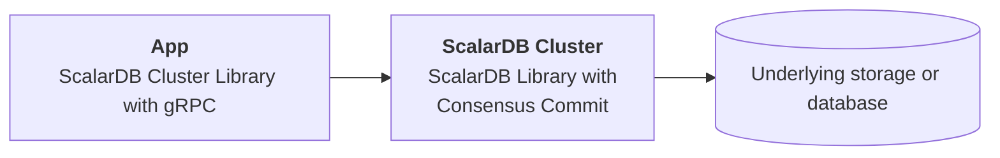
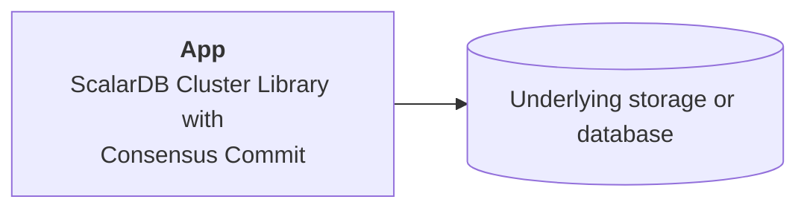
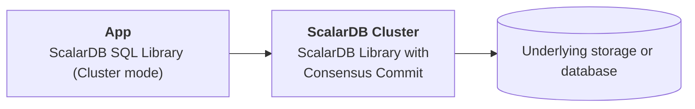
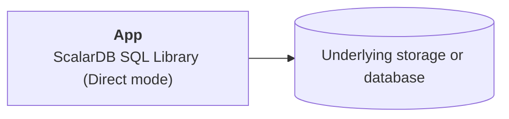

# Production checklist for ScalarDB Cluster

This checklist provides recommendations when deploying ScalarDB Cluster in a production environment.

## Before you begin

In this checklist, we assume that you are deploying ScalarDB Cluster on a managed Kubernetes cluster, which is recommended.

## Production checklist: ScalarDB Cluster

The following is a checklist of recommendations when setting up ScalarDB Cluster in a production environment.

### Number of pods and Kubernetes worker nodes

To ensure that the Kubernetes cluster has high availability, you should use at least three worker nodes and deploy at least three pods spread across the worker nodes. You can see the [sample configurations](../conf/scalardb-cluster-custom-values-indirect-mode.yaml) of `podAntiAffinity` for making three pods spread across the worker nodes.


**Note**

If you place the worker nodes in different availability zones (AZs), you can withstand an AZ failure.


{{ notice--info | markdownify }}

### Worker node specifications

From the perspective of commercial licenses, resources for one pod running ScalarDB Cluster are limited to 2vCPU / 4GB memory. In addition, some pods other than ScalarDB Cluster pods exist on the worker nodes.

In other words, the following components could run on one worker node:

* ScalarDB Cluster pod (2vCPU / 4GB)
* Envoy proxy (if you use `indirect` client mode or use a programming language other than Java)
* Your application pods (if you choose to run your application's pods on the same worker node)
* Monitoring components (if you deploy monitoring components such `kube-prometheus-stack`)
* Kubernetes components


**Note**

You do not need to deploy an Envoy pod when using `direct-kubernetes` mode.


{{ notice--info | markdownify }}

With this in mind, you should use a worker node that has at least 4vCPU / 8GB memory resources and use at least three worker nodes for availability, as mentioned in [Number of pods and Kubernetes worker nodes](./ProductionChecklistForScalarDBCluster.md#number-of-pods-and-kubernetes-worker-nodes).

However, three nodes with at least 4vCPU / 8GB memory resources per node is the minimum for a production environment. You should also consider the resources of the Kubernetes cluster (for example, the number of worker nodes, vCPUs per node, memories per node, ScalarDB Cluster pods, and pods for your application), which depend on your system's workload. In addition, if you plan to scale the pods automatically by using some features like [Horizontal Pod Autoscaling (HPA)](https://kubernetes.io/docs/tasks/run-application/horizontal-pod-autoscale/), you should consider the maximum number of pods on the worker node to decide on the worker node resources.

### Network

You should create the Kubernetes cluster on a private network since ScalarDB Cluster does not provide any services to users directly via internet access. We recommend accessing ScalarDB Cluster via a private network from your applications.

### Monitoring and logging

You should monitor the deployed components and collect their logs. For details, see [Monitoring Scalar products on a Kubernetes cluster](./K8sMonitorGuide.md) and [Collecting logs from Scalar products on a Kubernetes cluster](./K8sLogCollectionGuide.md).

### Backup and restore

You should enable the automatic backup feature and point-in-time recovery (PITR) feature in the backend database. For details, see [Set up a database for ScalarDB/ScalarDL deployment](./SetupDatabase.md).

## Production checklist: Client applications that access ScalarDB Cluster

The following is a checklist of recommendations when setting up a client application that accesses ScalarDB Cluster in a production environment.

### Client mode (Java client library only)

When using Java for your application, you can use an official Java client library. In this case, you can choose one of the two client modes: [`direct-kubernetes mode`](https://github.com/scalar-labs/scalardb-cluster/blob/main/docs/developer-guide-for-scalardb-cluster-with-java-api.md#direct-kubernetes-client-mode) or [`indirect mode`](https://github.com/scalar-labs/scalardb-cluster/blob/main/docs/developer-guide-for-scalardb-cluster-with-java-api.md#indirect-client-mode).

From the perspective of performance, we recommend using `direct-kubernetes` mode. To use `direct-kubernetes` mode, you must deploy your application pods on the same Kubernetes cluster as ScalarDB Cluster pods. In this case, you don't need to deploy Envoy pods.

If you can't deploy your Java application pods on the same Kubernetes cluster as ScalarDB Cluster pods for some reason, you must use `indirect` mode. In this case, you must deploy Envoy pods.


**Note**

The client mode configuration is dedicated to the Java client library. If you use a programming language other than Java for your application (essentially, if you use the [gRPC API](https://github.com/scalar-labs/scalardb-cluster/blob/main/docs/scalardb-cluster-grpc-api-guide.md) or [gRPC SQL API](https://github.com/scalar-labs/scalardb-cluster/blob/main/docs/scalardb-cluster-sql-grpc-api-guide.md) directly from the programming language), no such configuration exists. In this case, you must deploy Envoy pods.


{{ notice--info | markdownify }}

### Transaction manager configuration (Java client library only)

The client application must always access the database through ScalarDB Cluster. To ensure requests are running properly, check the properties file for your client application and confirm that `scalar.db.transaction_manager=cluster` is configured when using the CRUD API.

#### Recommended for production environments

#### Not recommended for production environments (for testing purposes only)

### SQL connection configuration (Java client library only)

The client application must always access the database through ScalarDB Cluster. To ensure requests are running properly, check the properties file for your client application and confirm that `scalar.db.sql.connection_mode=cluster` is configured when using the SQL API.

#### Recommended for production environments

#### Not recommended for production environments (for testing purposes only)

### Deployment of the client application when using `direct-kubernetes` client mode (Java client library only)

If you use [`direct-kubernetes` client mode](https://github.com/scalar-labs/scalardb-cluster/blob/main/docs/developer-guide-for-scalardb-cluster-with-java-api.md#direct-kubernetes-client-mode), you must deploy your client application on the same Kubernetes cluster as the ScalarDB Cluster deployment.

Also, when using `direct-kubernetes` client mode, you must deploy additional Kubernetes resources to make your client application work properly. For details, see [Deploy your client application on Kubernetes with `direct-kubernetes` mode](https://github.com/scalar-labs/helm-charts/blob/main/docs/how-to-deploy-scalardb-cluster.md#deploy-your-client-application-on-kubernetes-with-direct-kubernetes-mode).

### Transaction handling (Java client library and gRPC API)

You must make sure that your application always runs [`commit()`](https://github.com/scalar-labs/scalardb/blob/master/docs/api-guide.md#commit-a-transaction) or [`rollback()`](https://github.com/scalar-labs/scalardb/blob/master/docs/api-guide.md#roll-back-or-abort-a-transaction) after you [`begin()`](https://github.com/scalar-labs/scalardb/blob/master/docs/api-guide.md#begin-or-start-a-transaction) a transaction. If the application does not run `commit()` or `rollback()`, your application might experience unexpected issues or read inconsistent data from the backend database.


**Note**

If you use the [gRPC API](https://github.com/scalar-labs/scalardb-cluster/blob/main/docs/scalardb-cluster-grpc-api-guide.md) or [SQL gRPC API](https://github.com/scalar-labs/scalardb-cluster/blob/main/docs/scalardb-cluster-sql-grpc-api-guide.md), your application should call a `Commit` or `Rollback` service after you call a `Begin` service to begin a transaction.


{{ notice--info | markdownify }}

### Exception handling (Java client library and gRPC API)

You must make sure that your application handles transaction exceptions. For details, see the document for the API that you are using:

* [Handle exceptions (Transactional API)](https://github.com/scalar-labs/scalardb/blob/master/docs/api-guide.md#handle-exceptions).
* [Handle exceptions (two-phase commit transactions API)](https://github.com/scalar-labs/scalardb/blob/master/docs/two-phase-commit-transactions.md#handle-exceptions)
* [Execute transactions (ScalarDB SQL API)](https://github.com/scalar-labs/scalardb-sql/blob/main/docs/sql-api-guide.md#execute-transactions)
* [Handle SQLException (ScalarDB JDBC)](https://github.com/scalar-labs/scalardb-sql/blob/main/docs/jdbc-guide.md#handle-sqlexception)
* [Error handling (ScalarDB Cluster gRPC API)](https://github.com/scalar-labs/scalardb-cluster/blob/main/docs/scalardb-cluster-grpc-api-guide.md#error-handling-1)
* [Error handling (ScalarDB Cluster SQL gRPC API)](https://github.com/scalar-labs/scalardb-cluster/blob/main/docs/scalardb-cluster-sql-grpc-api-guide.md#error-handling-1)
