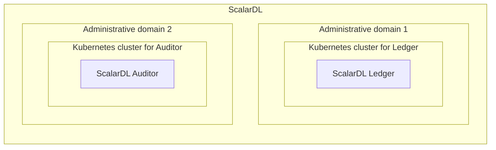
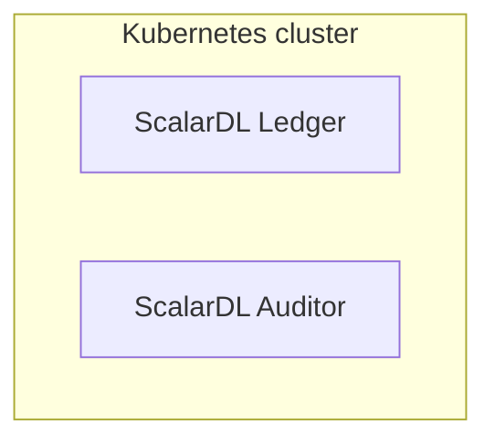
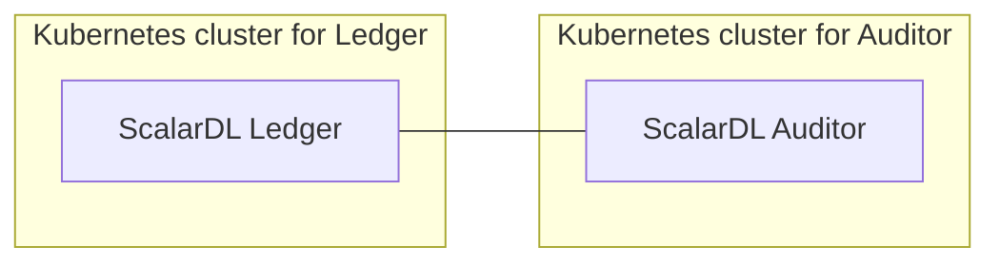
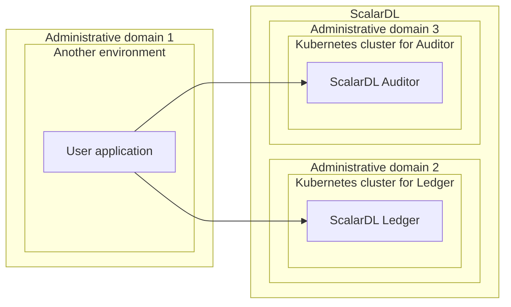
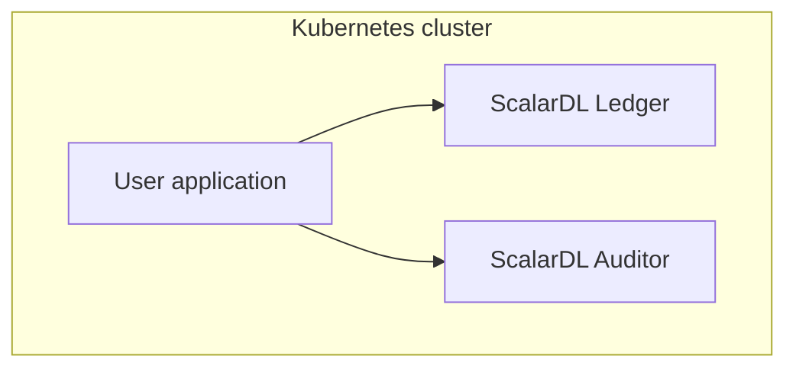

> [!CAUTION]
> 
> The contents of the `docs` folder have been moved to the [docs-internal-orchestration](https://github.com/scalar-labs/docs-internal-orchestration) repository. Please update this documentation in that repository instead.
> 
> To view the Scalar Kubernetes documentation, visit the documentation site for the product you are using:
> 
> - [ScalarDB Enterprise Documentation](https://scalardb.scalar-labs.com/docs/latest/scalar-kubernetes/deploy-kubernetes/).
> - [ScalarDL Documentation](https://scalardl.scalar-labs.com/docs/latest/scalar-kubernetes/deploy-kubernetes/).

# Production checklist for ScalarDL Auditor

This checklist provides recommendations when deploying ScalarDL Auditor in a production environment.

## Before you begin

In this checklist, we assume that you are deploying ScalarDL Auditor on a managed Kubernetes cluster, which is recommended.

## Production checklist: ScalarDL Auditor

The following is a checklist of recommendations when setting up ScalarDL Auditor in a production environment.

### ScalarDL availability

To ensure that the Kubernetes cluster has high availability, you should use at least three worker nodes and deploy at least three pods spread across the worker nodes. You can see the [sample configurations](../conf/scalardl-audit-custom-values.yaml) of `podAntiAffinity` for making three pods spread across the worker nodes.


**Note**

If you place the worker nodes in different availability zones (AZs), you can withstand an AZ failure.


<div class="notice--info">{{ notice--info | markdownify }}</div>

### Resources

From the perspective of commercial licenses, resources for one pod running ScalarDL Auditor are limited to 2vCPU / 4GB memory. In addition to the ScalarDL Auditor pod, Kubernetes could deploy some of the following components to each worker node:

* ScalarDL Auditor pod (2vCPU / 4GB)
* Envoy proxy
* Monitoring components (if you deploy monitoring components such as `kube-prometheus-stack`)
* Kubernetes components

With this in mind, you should use a worker node that has at least 4vCPU / 8GB memory resources and use at least three worker nodes for availability, as mentioned in [ScalarDL availability](#scalardl-availability).

However, three nodes with at least 4vCPU / 8GB memory resources per node is the minimum environment for production. You should also consider the resources of the Kubernetes cluster (for example, the number of worker nodes, vCPUs per node, memory per node, and ScalarDL Auditor pods), which depend on your system's workload. In addition, if you plan to scale the pods automatically by using some features like [Horizontal Pod Autoscaling (HPA)](https://kubernetes.io/docs/tasks/run-application/horizontal-pod-autoscale/), you should consider the maximum number of pods on the worker node when deciding the worker node resources.

### Network

You should create the Kubernetes cluster on a private network since ScalarDL Auditor does not provide any services to users directly via internet access. We recommend accessing ScalarDL Auditor via a private network from your applications.

### Monitoring and logging

You should monitor the deployed components and collect their logs. For details, see [Monitoring Scalar products on a Kubernetes cluster](./K8sMonitorGuide.md) and [Collecting logs from Scalar products on a Kubernetes cluster](./K8sLogCollectionGuide.md).

### Backup and restore

You should enable the automatic backup feature and point-in-time recovery (PITR) feature in the backend database. For details, see [Set up a database for ScalarDB/ScalarDL deployment](./SetupDatabase.md).

### ScalarDL Auditor deployment

For Byzantine fault detection in ScalarDL to work properly, do not deploy ScalarDL Auditor pods on the same Kubernetes clusters as the ScalarDL Ledger deployment. Instead, you must deploy ScalarDL Auditor pods in an environment other than the administrative domain (other than the Kubernetes cluster) for the ScalarDL Ledger deployment.

#### Required for production environments



#### Not recommended for production environments (for testing purposes only)



### Connection between ScalarDL Ledger and ScalarDL Auditor

For ScalarDL Auditor mode to work properly, you must allow the connection between ScalarDL Ledger and ScalarDL Auditor.



ScalarDL uses the following ports for the connections between ScalarDL Ledger and ScalarDL Auditor. You must allow these connections between ScalarDL Ledger and ScalarDL Auditor:

* ScalarDL Ledger
  * 50051/TCP
  * 50052/TCP
* ScalarDL Auditor
  * 40051/TCP
  * 40052/TCP

### Private key and certificate

When you use PKI for authentication, you must make sure that private keys and certificates that you register to ScalarDL Ledger and ScalaDL Auditor match the following requirements:

```console
Algorithm       : ECDSA
Hash function   : SHA256
Curve parameter : P-256
```

For details, see [How to get a certificate](https://github.com/scalar-labs/scalardl/blob/master/docs/ca/caclient-getting-started.md).

## Production checklist: Client applications that access ScalarDL Auditor

The following is a checklist of recommendations when setting up a client application that accesses ScalarDL Auditor in a production environment.

### Client application deployment

For Byzantine fault detection in ScalarDL to work properly, do not deploy your application pods on the same Kubernetes clusters as the ScalarDL deployment. Instead, you must deploy your application in an environment other than the administrative domain (other than the Kubernetes cluster) for the ScalarDL deployment.

#### Required for production environments



#### Not recommended for production environments (for testing purposes only)



### Client application checklist

You must also make sure that you satisfy the [Production checklist: Client applications that access ScalarDL Ledger](./ProductionChecklistForScalarDLLedger.md#production-checklist-client-applications-that-access-scalardl-ledger).
