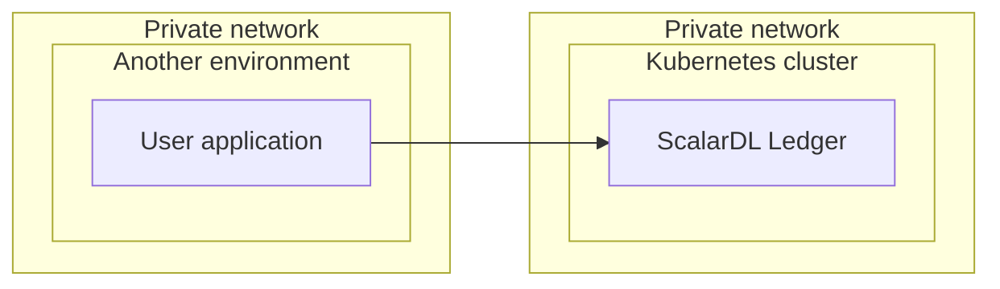
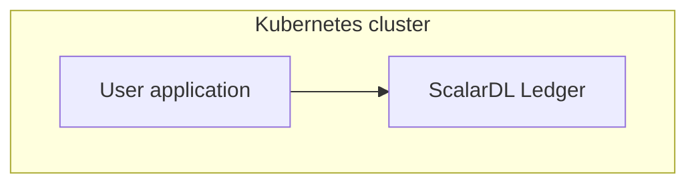

# Production checklist for ScalarDL Ledger

This checklist provides recommendations when deploying ScalarDL Ledger in a production environment.

## Before you begin

In this checklist, we assume that you are deploying ScalarDL Ledger on a managed Kubernetes cluster, which is recommended.

## Production checklist: ScalarDL Ledger

The following is a checklist of recommendations when setting up ScalarDL Ledger in a production environment.

### Number of pods and Kubernetes worker nodes

To ensure that the Kubernetes cluster has high availability, you should use at least three worker nodes and deploy at least three pods spread across the worker nodes. You can see the [sample configurations](../conf/scalardl-custom-values.yaml) of `podAntiAffinity` for making three pods spread across the worker nodes.


**Note**

If you place the worker nodes in different availability zones (AZs), you can withstand an AZ failure.


<div class="notice--info">{{ notice--info | markdownify }}</div>

### Worker node specifications

From the perspective of commercial licenses, resources for one pod running ScalarDL Ledger are limited to 2vCPU / 4GB memory. In addition, some pods other than ScalarDL Ledger pods exist on the worker nodes.

In other words, the following components could run on one worker node:

* ScalarDL Ledger pod (2vCPU / 4GB)
* Envoy proxy
* Monitoring components (if you deploy monitoring components such `kube-prometheus-stack`)
* Kubernetes components

With this in mind, you should use a worker node that has at least 4vCPU / 8GB memory resources and use at least three worker nodes for availability, as mentioned in [Number of pods and Kubernetes worker nodes](#number-of-pods-and-kubernetes-worker-nodes).

However, three nodes with at least 4vCPU / 8GB memory resources per node is the minimum for a production environment. You should also consider the resources of the Kubernetes cluster (for example, the number of worker nodes, vCPUs per node, memories per node, and ScalarDL Ledger pods), which depend on your system's workload. In addition, if you plan to scale the pods automatically by using some features like [Horizontal Pod Autoscaling (HPA)](https://kubernetes.io/docs/tasks/run-application/horizontal-pod-autoscale/), you should consider the maximum number of pods on the worker node to decide on the worker node resources.

### Network

You should create the Kubernetes cluster on a private network since ScalarDL Ledger does not provide any services to users directly via internet access. We recommend accessing ScalarDL Ledger via a private network from your applications.

### Monitoring and logging

You should monitor the deployed components and collect their logs. For details, see [Monitoring Scalar products on a Kubernetes cluster](./K8sMonitorGuide.md) and [Collecting logs from Scalar products on a Kubernetes cluster](./K8sLogCollectionGuide.md).

### Backup and restore

You should enable the automatic backup feature and point-in-time recovery (PITR) feature in the backend database. For details, see [Set up a database for ScalarDB/ScalarDL deployment](./SetupDatabase.md).

## Production checklist: Client applications that access ScalarDL Ledger

The following is a checklist of recommendations when setting up a client application that accesses ScalarDL Ledger in a production environment.

### Do not deploy your application on the same Kubernetes cluster as ScalarDL Ledger

For Byzantine fault detection in ScalarDL to work properly, do not deploy your application pods on the same Kubernetes clusters as the ScalarDL Ledger deployment. Please deploy your application on an environment other than the Kubernetes cluster for ScalarDL Ledger deployment.

#### Required for production environments



#### Not recommended for production environments (for testing purposes only)



### Return assets that you read in the contract

For Byzantine fault detection in ScalarDL to work properly, you must return all assets that you read in the contract. If you don't return assets, the Byzantine fault detection doesn't work properly.

#### Return assets (required for Byzantine fault detection)

```java
public class StateReader extends JacksonBasedContract {

  @Nullable
  @Override
  public JsonNode invoke(
      Ledger<JsonNode> ledger, JsonNode argument, @Nullable JsonNode properties) {

    String assetId = argument.get("asset_id").asText();
    Optional<Asset<JsonNode>> asset = ledger.get(assetId);

    return asset
        .map(
            value ->
                (JsonNode)
                    getObjectMapper()
                        .createObjectNode()
                        .put("id", value.id())
                        .put("age", value.age())
                        .set("output", value.data()))
        .orElse(null);
  }
}
```

#### Not return assets (Byzantine fault detection doesn't work properly)

```java
public class StateReader extends JacksonBasedContract {

  @Nullable
  @Override
  public JsonNode invoke(
      Ledger<JsonNode> ledger, JsonNode argument, @Nullable JsonNode properties) {

    String assetId = argument.get("asset_id").asText();
    Optional<Asset<JsonNode>> asset = ledger.get(assetId);

    return null;
  }
}
```

### Versioning contracts

When you register a contract once, you cannot overwrite the existing contract. So, you should consider the versioning of contracts. We recommend one of the following two methods:

#### Versioning by using `Class Name`

```console
Contract ID              : FooV1
Binary Name              : com.example.contract.FooV1
Class file (Class Name)  : src/main/java/com/example/contract/FooV1.class
---
Contract ID              : FooV2
Binary Name              : com.example.contract.FooV2
Class file (Class Name)  : src/main/java/com/example/contract/FooV2.class
```

#### Versioning by using `Package Name`

```console
Contract ID             : FooV3
Binary Name             : com.example.contract.v3.Foo
Class file (Class Name) : src/main/java/com/example/contract/v3/Foo.class
---
Contract ID             : FooV4
Binary Name             : com.example.contract.v4.Foo
Class file (Class Name) : src/main/java/com/example/contract/v4/Foo.class
```

### Use the same binary name, package name, and class name when you register the contract

If the binary name, package name, and class name are different when you register the contract, you cannot execute such a contract after you register it.

#### Binary name and class name are different (you cannot execute this contract)

```console
Contract ID              : FooV5
Binary Name              : com.example.contract.FooV5
Class file (Class Name)  : src/main/java/com/example/contract/FooV6.class
```

#### Binary name and package name are different (you cannot execute this contract)

```console
Contract ID              : FooV7
Binary Name              : com.example.contract.v7.Foo
Class file (Class Name)  : src/main/java/com/example/contract/v8/Foo.class
```

### Secret key and certification file requirements

You must make sure that your secret key and certification file match the following ScalarDL requirements.

```console
Algorithm       : ECDSA
Hash function   : SHA256
Curve parameter : P-256
```

For details, see [How to get a certificate](https://github.com/scalar-labs/scalardl/blob/master/docs/ca/caclient-getting-started.md).

### Exception handling

You must make sure that your application handles exceptions. For details, see [A Guide on How to Handle Errors in ScalarDL](https://github.com/scalar-labs/scalardl/blob/master/docs/how-to-handle-errors.md).
