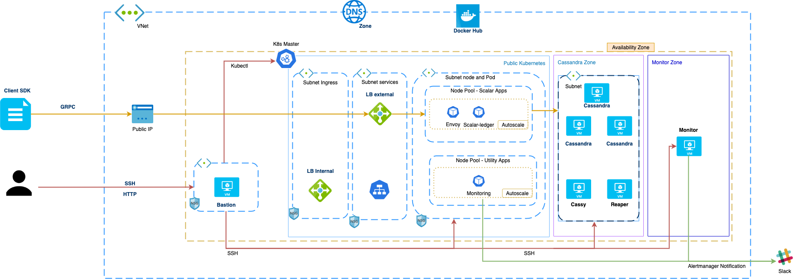

# How to Deploy Scalar DL on Azure AKS

This example will deploy a simple Scalar DL environment in the Japaneast region with your Azure account. If you want to use another region or store the tfstate on Azure you need to update `backend.tf`, `examples.tfvars` and `remote.tf` of each module.

## Prerequisites

* Terraform >= 0.12.x
* Ansible >= 2.9
* Python lib jmespath >= latest (`pip install jmespath`)
* Azure CLI
* ssh-agent with a private key

You also need to have enough permissions to deploy the Kubernetes cluster with Terraform. Please see [Cloud Privileges for scalar-k8s](./CloudPrivileges.md#Azure) for more detail.

## Architecture



## What is created

* An Azure VPC associated with Resource Group
* An AKS cluster with two Kubernetes node pools
* 3 Envoy Kubernetes Pods with a network load balancer
* 3 Scalar DL Kubernetes Pods
* 1 Prometheus operator to collect metrics inside Kubernetes
* 1 FluentBit Pod on each node to collect Kubernetes log
* DNS Zone for internal host lookup
* With Cassandra option (default):
  * 3 Cassandra instances
  * 1 Cassy instance
  * 1 Reaper instance
* With Cosmos DB option:
  * A Cosmos DB Account
* 1 Bastion instance with a public IP
* 1 Monitor instance to collect metrics and logs

## Database Options

On Azure, there are two options for the backend database: Cassandra and Cosmos DB. Cassandra is the default. 

## How to deploy

### Configure an Azure credential

```console
az login
```

### Create network resources

```console
# Please update `/path/to/local-repository` before running the command.
$ export SCALAR_K8S_HOME=/path/to/local-repository
$ cd ${SCALAR_K8S_HOME}/modules/azure/network

# Generate a test key-pair
$ ssh-keygen -b 2048 -t rsa -f ./example_key -q -N ""
$ chmod 400 example_key

# You need to add the key to your ssh agent
$ ssh-add example_key

# Create an environment and bastion server
$ terraform init

# Update the "name" to an unique value for your deployment inside "example.tfvars"
$ terraform apply -var-file example.tfvars
```

Note that the current version uses [the network module](https://github.com/scalar-labs/scalar-terraform/tree/master/modules/azure/network) of [scalar-terraform](https://github.com/scalar-labs/scalar-terraform).  It uses the master branch but it would probably need to be changed if you deploy it in your production environment.

### Create Kubernetes cluster

* If you use Cosmos DB, please set `use_cosmosdb` to `true` in `example.tfvars` before you run `terraform apply`

    ```
    use_cosmosdb = true
    ```

```
$ cd ${SCALAR_K8S_HOME}/examples/azure/kubernetes

# Create the Kubernetes cluster
$ terraform init
$ terraform apply -var-file example.tfvars
```

For more information about the variable in `example.tfvars`, please refer to [kubernetes modules](../modules/azure/kubernetes/README.md)

### Create database resources

Deploy either a Cassandra cluster or a Cosmos DB account, depending on your choice.

#### Cassandra

```console
$ cd ${SCALAR_K8S_HOME}/modules/azure/cassandra

# Create the cassandra cluster
$ terraform init
$ terraform apply -var-file example.tfvars
```

Note that the current version uses [the cassandra module](https://github.com/scalar-labs/scalar-terraform/tree/master/modules/azure/cassandra) of [scalar-terraform](https://github.com/scalar-labs/scalar-terraform). It uses the master branch but it would probably need to be changed if you deploy it in your production environment.

#### Cosmos DB

```console
$ cd ${SCALAR_K8S_HOME}/modules/azure/kubernetes

# Create Cosmos DB account
$ terraform init
$ terraform apply -var-file example.tfvars
```

Note that the current version uses [the cosmosdb module](https://github.com/scalar-labs/scalar-terraform/tree/master/modules/azure/cosmosdb) of [scalar-terraform](https://github.com/scalar-labs/scalar-terraform). It uses the master branch but it would probably need to be changed if you deploy it in your production environment.

### Create Monitor resources

The Scalar deployment tools include a Prometheus metrics server, Grafana data visualization server, and Alertmanager server for cassandra cluster, cassy, and bastion server

* If you use Cosmos DB, please remove `cassandra` from `targets` in `example.tfvars` since the monitor module is not able to monitor Cosmos DB.

    ```hcl
    targets = []
    ```

```console
$ cd ${SCALAR_K8S_HOME}/modules/azure/monitor

# Create the monitor server for cassandra modules and log collection
$ terraform init
$ terraform apply -var-file example.tfvars
```

Note that the current version uses [the monitor module](https://github.com/scalar-labs/scalar-terraform/tree/master/modules/azure/monitor) of [scalar-terraform](https://github.com/scalar-labs/scalar-terraform/). It uses the master branch but it would probably need to be changed if you deploy it in your production environment.

### Decide where to store configuration files for accessing the k8s cluster

Please decide which directory you want to use to store configuration files for accessing the k8s cluster.
It is recommended to be set outside of the repo since it should be separately managed per project.

```console
# Please update `/path/to/local-repository-config-dir` before running the command.
$ export SCALAR_K8S_CONFIG_DIR=/path/to/local-repository-config-dir
```

Copy from `conf` directory to `${SCALAR_K8S_CONFIG_DIR}`

```console
$ cp ${SCALAR_K8S_HOME}/conf/{scalardl-custom-values.yaml,schema-loading-custom-values.yaml} ${SCALAR_K8S_CONFIG_DIR}/
```

### Setup bastion for accessing Kubernetes cluster

```console
# Create inventory for ansible
$ cd ${SCALAR_K8S_HOME}/modules/azure/kubernetes/
$ terraform output inventory_ini > ${SCALAR_K8S_CONFIG_DIR}/inventory.ini

# Retrieve kube_config for setup kubectl
$ cd ${SCALAR_K8S_HOME}/modules/azure/kubernetes/
$ terraform output kube_config > ${SCALAR_K8S_CONFIG_DIR}/kube_config

# Setup bastion for Kubernetes
$ cd ${SCALAR_K8S_HOME}
$ export ANSIBLE_CONFIG=${SCALAR_K8S_HOME}/playbooks/ansible.cfg
$ ansible-playbook -i ${SCALAR_K8S_CONFIG_DIR}/inventory.ini playbooks/playbook-install-tools.yml
```

Please refer to [How to install Kubernetes CLI and Helm on the bastion](./PrepareBastionTool.md) for more information.

### Deploy Prometheus for Kubernetes resources

How to deploy Prometheus metrics server, Grafana data visualization server, and Alertmanager server for Kubernetes resource only. Normally, accessing the Grafana server is enough to see the overall system status.

```console
$ cd ${SCALAR_K8S_HOME}

# Deploy prometheus operator in Kubernetes
$ ansible-playbook -i ${SCALAR_K8S_CONFIG_DIR}/inventory.ini playbooks/playbook-deploy-prometheus.yml
```

Please refer to [Kubernetes Monitor Guide](./KubernetesMonitorGuide.md) for more information.

### Deploy log collection for Kubernetes resources

```console
$ cd ${SCALAR_K8S_HOME}

# Deploy fluentbit to collect log from Kubernetes
$ ansible-playbook -i ${SCALAR_K8S_CONFIG_DIR}/inventory.ini playbooks/playbook-deploy-fluentbit.yml
```

Please refer to [How to collect logs from Kubernetes applications](./K8sLogCollectionGuide.md) for more information.

### Create Scalar DL and Envoy resources

You need an authority to pull `scalarlabs/scalar-ledger` and `scalarlabs/scalardl-schema-loader` docker repositories. (Note that they are available to only our partners and customers at the moment.)

You also need set `DOCKERHUB_USER` and `DOCKERHUB_ACCESS_TOKEN` as environment variables or set the values directly in the `${SCALAR_K8S_HOME}/playbooks/playbook-deploy-scalardl.yml` for `docker_username` and `docker_password`.

* If you use Cosmos DB, you need to update the `schema-loading-custom-values.yaml`. Please follow [the extra steps](./DeployScalarDL.md#using-cosmos-db-storage) before applying the playbook below.
* If you use a different internal domain name from the default `internal.scalar-labs.com`, please follow [the extra step](./DeployScalarDL.md#use-a-different-internal-domain) before applying the playbook below.


```console
$ cd ${SCALAR_K8S_HOME}

# export docker secrets for ansible
$ export DOCKERHUB_USER=<user>
$ export DOCKERHUB_ACCESS_TOKEN=<token>

# Deploy Scalar DL and Envoy resources
$ ansible-playbook -i ${SCALAR_K8S_CONFIG_DIR}/inventory.ini playbooks/playbook-deploy-scalardl.yml
```

Please refer to [How to deploy Scalar DL on Kubernetes with Ansible](./DeployScalarDL.md) for more information like: add more pod for envoy or change resource.

## Generate outputs

You can get some useful information about your deployments, such as a bastion public, internal IP addresses, and ssh config that you can use to access instances. The ssh config assumes that the private key for an environment is added to your ssh-agent.

### Network

```console
$ cd ${SCALAR_K8S_HOME}/modules/azure/network
$ terraform output
bastion_ip = bastion-example-k8s-azure-b8ci1si.eastus.cloudapp.azure.com
bastion_provision_id = 2467232388962733384
dns_zone_id = internal.scalar-labs.com
image_id = CentOS
internal_domain = internal.scalar-labs.com
location = East US
network_cidr = 10.42.0.0/16
network_id = /subscriptions/xxxxxxxx-xxxx-xxxx-xxxx-xxxxxxxxxxxx/resourceGroups/example-k8s-azure-fpjzfyk/providers/Microsoft.Network/virtualNetworks/example-k8s-azure-fpjzfyk
network_name = example-k8s-azure-fpjzfyk
private_key_path = /path/to/local-repository/scalar-k8s/modules/azure/network/example_key
public_key_path = /path/to/local-repository/scalar-k8s/modules/azure/network/example_key.pub
ssh_config = Host *
User centos
UserKnownHostsFile /dev/null
StrictHostKeyChecking no

Host bastion
HostName bastion-example-k8s-azure-b8ci1si.eastus.cloudapp.azure.com
LocalForward 8000 monitor.internal.scalar-labs.com:80

Host *.internal.scalar-labs.com
ProxyCommand ssh -F ssh.cfg bastion -W %h:%p

subnet_map = {
  "cassandra" = "/subscriptions/xxxxxxxx-xxxx-xxxx-xxxx-xxxxxxxxxxxx/resourceGroups/example-k8s-azure-fpjzfyk/providers/Microsoft.Network/virtualNetworks/example-k8s-azure-fpjzfyk/subnets/cassandra"
  "private" = "/subscriptions/xxxxxxxx-xxxx-xxxx-xxxx-xxxxxxxxxxxx/resourceGroups/example-k8s-azure-fpjzfyk/providers/Microsoft.Network/virtualNetworks/example-k8s-azure-fpjzfyk/subnets/private"
  "public" = "/subscriptions/xxxxxxxx-xxxx-xxxx-xxxx-xxxxxxxxxxxx/resourceGroups/example-k8s-azure-fpjzfyk/providers/Microsoft.Network/virtualNetworks/example-k8s-azure-fpjzfyk/subnets/public"
}
user_name = centos
```

### Cassandra

```console
$ cd ${SCALAR_K8S_HOME}/modules/azure/cassandra
$ terraform output
cassandra_provision_ids = [
  "4019088576544490630",
  "656319024837932240",
  "2469094098071954264",
]
cassandra_resource_count = 3
cassandra_start_on_initial_boot = false
```

### How to access instances

```console
$ cd ${SCALAR_K8S_HOME}/modules/azure/network

# Generate SSH config to make it easy to access backend resources
$ terraform output ssh_config > ssh.cfg

# How to connect
$ ssh -F ssh.cfg cassandra-1.internal.scalar-labs.com
$ ssh -F ssh.cfg cassandra-2.internal.scalar-labs.com
$ ssh -F ssh.cfg cassandra-3.internal.scalar-labs.com

$ ssh -F ssh.cfg cassy-1.internal.scalar-labs.com
$ ssh -F ssh.cfg reaper-1.internal.scalar-labs.com
$ ssh -F ssh.cfg monitor-1.internal.scalar-labs.com
```

### Kubernetes

#### Kubernetes Credential

You need to export the `kube_config` from terraform and after find `server` line and replace with `https://localhost:7000` . finally copy into `~/.kube/config`

```console
$ cd ${SCALAR_K8S_HOME}/modules/azure/kubernetes
$ terraform output kube_config
```

```yml
apiVersion: v1
clusters:
- cluster:
    certificate-authority-data: LS0tLS1...
    server: https://localhost:7000 # https://scalar-k8s-c1eae570.fdc2c430-cd60-4952-b269-28d1c1583ca7.privatelink.eastus.azmk8s.io:443
  name: scalar-kubernetes
contexts:
- context:
    cluster: scalar-kubernetes
    user: clusterUser_example-k8s-azure-znmhbo_scalar-kubernetes
  name: scalar-kubernetes
current-context: scalar-kubernetes
kind: Config
preferences: {}
users:
- name: clusterUser_example-k8s-azure-znmhbo_scalar-kubernetes
  user:
    client-certificate-data: LS0tLS1C....
    client-key-data: LS0tLS...
    token: 48fdda...
```

#### Generate SSH Config

The following command will generate a `ssh.cfg` with `LocalForward` to access the Kubernetes API from your local machine.

```console
$ cd ${SCALAR_K8S_HOME}/modules/azure/kubernetes
$ terraform output k8s_ssh_config
Host *
  UserKnownHostsFile /dev/null
  StrictHostKeyChecking no

Host bastion
  HostName bastion-example-k8s-azure-b8ci1si.eastus.cloudapp.azure.com
  User centos
  LocalForward 8000 monitor.internal.scalar-labs.com:80
  LocalForward 7000 scalar-k8s-72b7f3f4.15539fa5-307a-46e3-aec3-d0e625c5cf8e.privatelink.eastus.azmk8s.io:443

Host *.internal.scalar-labs.com
  ProxyCommand ssh -F ssh.cfg bastion -W %h:%p

Host 10.*
  User azureuser
  ProxyCommand ssh -F ssh.cfg bastion -W %h:%p
```

```console
$ cd ${SCALAR_K8S_HOME}/modules/azure/kubernetes
$ terraform output k8s_ssh_config > ${SCALAR_K8S_CONFIG_DIR}/ssh.cfg
```

#### How to access to kubernetes from your local machine

Now let's access to kubernetes from your local machine. Open the ssh port-forward to the bastion, and let it open.

```console
$ cd ${SCALAR_K8S_CONFIG_DIR}
$ ssh -F ssh.cfg bastion
Warning: Permanently added 'bastion-example-k8s-azure-b8ci1si.eastus.cloudapp.azure.com,52.188.154.226' (ECDSA) to the list of known hosts.
[centos@bastion-1 ~]$
```

Open a new terminal or tab.

```console
$ kubectl get po,svc,endpoints,nodes -o wide
NAME                                         READY   STATUS      RESTARTS   AGE    IP             NODE                                   NOMINATED NODE   READINESS GATES
pod/prod-scalardl-envoy-84db4dbf46-rphpx    1/1     Running     0          115s   10.42.41.56    aks-scalardlpool-34802672-vmss000002   <none>           <none>
pod/prod-scalardl-envoy-84db4dbf46-wx94v    1/1     Running     0          115s   10.42.40.210   aks-scalardlpool-34802672-vmss000001   <none>           <none>
pod/prod-scalardl-envoy-84db4dbf46-zmkwl    1/1     Running     0          115s   10.42.40.160   aks-scalardlpool-34802672-vmss000000   <none>           <none>
pod/prod-scalardl-ledger-596c77dc5b-89t4w   1/1     Running     0          115s   10.42.40.116   aks-scalardlpool-34802672-vmss000000   <none>           <none>
pod/prod-scalardl-ledger-596c77dc5b-nvm2w   1/1     Running     0          115s   10.42.41.49    aks-scalardlpool-34802672-vmss000001   <none>           <none>
pod/prod-scalardl-ledger-596c77dc5b-pm4m9   1/1     Running     0          115s   10.42.41.122   aks-scalardlpool-34802672-vmss000002   <none>           <none>
pod/prod-scalardl-ledger-schema-d8t97       0/1     Completed   0          115s   10.42.40.82    aks-default-34802672-vmss000000        <none>           <none>

NAME                                     TYPE           CLUSTER-IP     EXTERNAL-IP   PORT(S)                           AGE    SELECTOR
service/kubernetes                       ClusterIP      10.42.48.1     <none>        443/TCP                           36m    <none>
service/prod-scalardl-envoy             LoadBalancer   10.42.50.239   10.42.44.4    50051:30702/TCP,50052:31533/TCP   115s   app.kubernetes.io/app=envoy,app.kubernetes.io/instance=prod,app.kubernetes.io/name=scalardl
service/prod-scalardl-envoy-metrics     ClusterIP      10.42.50.117   <none>        9001/TCP                          115s   app.kubernetes.io/app=envoy,app.kubernetes.io/instance=prod,app.kubernetes.io/name=scalardl
service/prod-scalardl-ledger-headless   ClusterIP      None           <none>        <none>                            115s   app.kubernetes.io/app=ledger,app.kubernetes.io/instance=prod,app.kubernetes.io/name=scalardl

NAME                                       ENDPOINTS                                                             AGE
endpoints/kubernetes                       10.42.40.4:443                                                        36m
endpoints/prod-scalardl-envoy             10.42.40.160:50052,10.42.40.210:50052,10.42.41.56:50052 + 3 more...   115s
endpoints/prod-scalardl-envoy-metrics     10.42.40.160:9001,10.42.40.210:9001,10.42.41.56:9001                  115s
endpoints/prod-scalardl-ledger-headless   10.42.40.116,10.42.41.122,10.42.41.49                                 115s

NAME                                        STATUS   ROLES   AGE   VERSION    INTERNAL-IP    EXTERNAL-IP   OS-IMAGE             KERNEL-VERSION      CONTAINER-RUNTIME
node/aks-default-34802672-vmss000000        Ready    agent   31m   v1.16.13   10.42.40.5     <none>        Ubuntu 16.04.6 LTS   4.15.0-1089-azure   docker://3.0.10+azure
node/aks-scalardlpool-34802672-vmss000000   Ready    agent   27m   v1.16.13   10.42.40.106   <none>        Ubuntu 16.04.6 LTS   4.15.0-1089-azure   docker://3.0.10+azure
node/aks-scalardlpool-34802672-vmss000001   Ready    agent   27m   v1.16.13   10.42.40.207   <none>        Ubuntu 16.04.6 LTS   4.15.0-1089-azure   docker://3.0.10+azure
node/aks-scalardlpool-34802672-vmss000002   Ready    agent   27m   v1.16.13   10.42.41.52    <none>        Ubuntu 16.04.6 LTS   4.15.0-1089-azure   docker://3.0.10+azure
```

The private endpoint is 10.42.44.4 on port 50051 and 50052

Please check out [Scalar DL Getting Started](https://scalardl.readthedocs.io/en/latest/getting-started/) to understand how to interact with the environment.

#### How to ssh to kubernetes nodes

To access to kubernetes node, look at the `INTERNAL-IP` from `kubectl get nodes -o wide`

```console
$ cd ${SCALAR_K8S_CONFIG_DIR}
$ ssh -F ssh.cfg 10.42.40.5
Warning: Permanently added 'bastion-example-k8s-azure-b8ci1si.eastus.cloudapp.azure.com,52.188.154.226' (ECDSA) to the list of known hosts.
Warning: Permanently added '10.42.40.5' (ECDSA) to the list of known hosts.
azureuser@aks-default-34802672-vmss000000:~$
```

## How to destroy

Don't forget to delete the entire environment with `terraform destroy` for each modules when you are finished.
